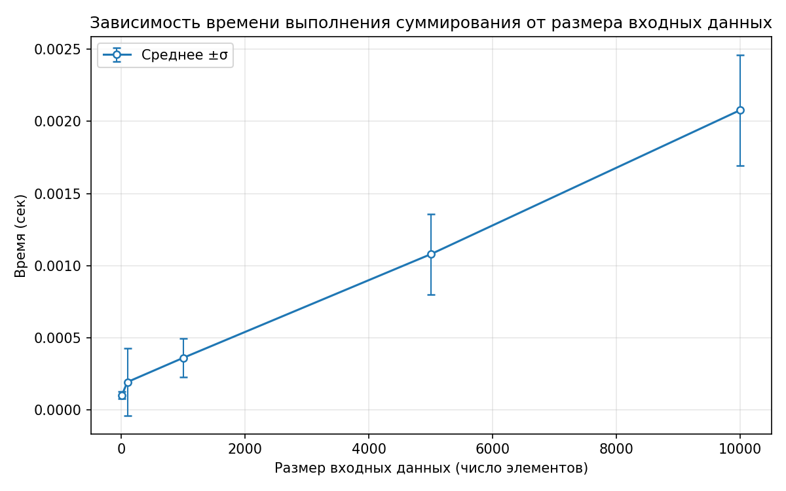

# Отчет по лабораторной работе [номер]
# [Название работы]

**Дата:** [YYYY-MM-DD]
**Семестр:** 5
**Группа:** ПИЖ-б-о-23-1
**Дисциплина:** Анализ сложности алгоритмов
**Студент:** Астраков Борис Александрович

## Цель работы
[Описание целей из задания]

## Теоретическая часть
[Краткое описание изученных концепций]

## Практическая часть

### Выполненные задачи
- [ ] Задача 1: [Описание]
- [ ] Задача 2: [Описание] 
- [ ] Задача 3: [Описание]

### Ключевые фрагменты кода
```[язык]
[Пример кода]
```markdown

## Результаты выполнения

### Пример работы программы
```bash
[Вывод программы]
```markdown

### Тестирование
- [ ] Модульные тесты пройдены
- [ ] Интеграционные тесты пройдены
- [ ] Производительность соответствует требованиям

## Выводы
1. [Основной вывод 1]
2. [Основной вывод 2]
3. [Основной вывод 3]

## Ответы на контрольные вопросы
1. [Вопрос] - [Ответ]
2. [Вопрос] - [Ответ]

## Приложения
- [Ссылки на исходный код]
- [Диаграммы и графики]
- [Дополнительные материалы]
## Результаты суммирования и эмпирический анализ
- Теоретическая сложность: O(n)
- Размеры данных: [10, 10, 100, 100, 1000, 1000, 5000, 5000, 10000, 10000]
- Время (сек): [0.0001740000006975606, 0.00013070000568404794, 0.00014650000957772136, 0.0001297999988310039, 0.00033680000342428684, 0.0013810999953420833, 0.0014004999975441024, 0.0016086999967228621, 0.005151699995622039, 0.002126400009728968]
- График: см. ниже



## Результаты суммирования и эмпирический анализ
- Теоретическая сложность: O(n)
- Размеры данных: [10, 10, 100, 100, 1000, 1000, 5000, 5000, 10000, 10000]
- Время (сек): [0.00035000000207219273, 0.00024349999148398638, 0.00023720000172033906, 0.00020049999875482172, 0.0005536999960895628, 0.0004867999959969893, 0.0012705999979516491, 0.0010745000035967678, 0.0021052999945823103, 0.003490199989755638]
- График: см. ниже


## Результаты суммирования и эмпирический анализ
- Теоретическая сложность: O(n)
- Размеры данных: [10, 10, 100, 100, 1000, 1000, 5000, 5000, 10000, 10000]
- Время (сек): [0.00018319999799132347, 0.00013720001152250916, 0.00014689999807160348, 0.00013810000382363796, 0.0003252000024076551, 0.0003605999954743311, 0.0013957000046502799, 0.0011154000094393268, 0.002938599995104596, 0.0020807999972021207]
- График: см. ниже


## Результаты суммирования и эмпирический анализ
- Теоретическая сложность: O(n)
- Размеры данных: [10, 10, 100, 100, 1000, 1000, 5000, 5000, 10000, 10000]
- Время (сек): [0.00015829999756533653, 0.0001294999965466559, 0.00013939999917056412, 0.00012840000272262841, 0.00033340000663883984, 0.000324200009345077, 0.0011357000039424747, 0.0013091000000713393, 0.002464499993948266, 0.0020851000008406118]
- График: см. ниже


## Результаты суммирования и эмпирический анализ
- Теоретическая сложность: O(n)
- Размеры данных: [10, 100, 1000, 10000, 5000, 10, 100, 1000, 10000, 5000]
- Время (сек): [0.00017189999925903976, 0.00015549999079667032, 0.0004622999986167997, 0.002581099994131364, 0.0010607000003801659, 0.00013929999840911478, 0.00013299999409355223, 0.0002901999978348613, 0.0017846999980974942, 0.0010403000051155686]
- График: см. ниже


## Результаты суммирования и эмпирический анализ
- Теоретическая сложность: O(n)
- Размеры данных: [10, 100, 1000, 10000, 5000, 10, 100, 1000, 10000, 5000]
- Время (сек), среднее: [0.00047542857438591976, 0.0001947571415387626, 0.0008829142835955801, 0.0046806714235572144, 0.00202301428570146, 0.00013424285446360175, 0.00012780000231162245, 0.0003176857114470165, 0.0039773285742350185, 0.0014474571424735977]
- Стандартное отклонение (сек): [0.0004986637665290019, 8.471788703859879e-05, 0.0004559489863513048, 0.0008728430309827802, 0.0005247068652672138, 3.542206136660973e-05, 1.4914422754049158e-05, 4.999369510317489e-05, 0.0017489749292013547, 0.0007052552972778483]
- График: см. ниже


## Результаты суммирования и эмпирический анализ
- Теоретическая сложность: O(n)
- Размеры данных: [10, 100, 1000, 10000, 5000, 10, 100, 1000, 10000, 5000]
- Время (сек), среднее: [0.00018577143159096262, 0.0001336142886430025, 0.0023331571428570896, 0.0027767285708770423, 0.0013187142862339637, 0.00012585714284796268, 0.0001509142873276557, 0.002382228564653945, 0.0024046142872456194, 0.001265842858369329]
- Стандартное отклонение (сек): [0.0001295936905925446, 1.747875805799634e-05, 0.004126329706796053, 0.00028333033262716587, 0.00020675988701298305, 2.1621605854419373e-05, 1.4776854111781817e-05, 0.004711150318621258, 0.00026982243319302027, 0.00026657791465999303]
- График: см. ниже


## Результаты суммирования и эмпирический анализ
- Теоретическая сложность: O(n)
- Размеры данных: [10, 100, 1000, 10000, 5000, 10, 100, 1000, 10000, 5000]
- Время (сек): [0.00045279999903868884, 0.0003205999964848161, 0.0006467000057455152, 0.0027388000016799197, 0.0012717000063275918, 0.00019419999443925917, 0.00018940000154543668, 0.0006012000085320324, 0.0027049999916926026, 0.00106229999801144]
- График: см. ниже


## Результаты суммирования и эмпирический анализ
- Теоретическая сложность: O(n)
- Размеры данных: [10, 100, 1000, 10000, 5000, 10, 100, 1000, 10000, 5000]
- Время (сек), среднее: [0.00011728571345364409, 0.0006241428615924503, 0.0003280999995435455, 0.0025243571414778542, 0.0017006285717278452, 0.00010905713965517602, 0.0018099857157462143, 0.0005327999990965639, 0.002507757139807966, 0.0010866285738302395]
- Стандартное отклонение (сек): [2.3194482644242462e-05, 0.0012013869163107508, 4.6004037833133316e-05, 0.0012145167573364695, 0.00031726304465191484, 2.1409865794786248e-05, 0.004142184606836285, 0.00012193495169106404, 0.000490605785895299, 0.00016102047868348274]
- График: см. ниже


## Результаты суммирования и эмпирический анализ
- Теоретическая сложность: O(n)
- Размеры данных: [10, 100, 1000, 10000, 5000, 10, 100, 1000, 10000, 5000]
- Время (сек), среднее: [0.00012154285754409752, 0.0016766428598202765, 0.0006864142861949014, 0.00200468571815041, 0.0011135857119890197, 0.000304057146422565, 0.0001291428572065862, 0.0022331428585208152, 0.002117271424919766, 0.0009444142883044801]
- Стандартное отклонение (сек): [3.137359538402517e-05, 0.0037856103816982464, 0.00030141146217399923, 0.00015341047352307967, 0.00026261300030078937, 0.00027833231775587224, 1.8207049226466e-05, 0.004594193973832161, 0.00036976114234035443, 3.8159869770722836e-05]
- График: см. ниже


## Результаты суммирования и эмпирический анализ
- Теоретическая сложность: O(n)
- Размеры данных: [10, 100, 1000, 10000, 5000, 10, 100, 1000, 10000, 5000]
- Время (сек), среднее: [0.00017161428903429105, 0.00013308571111078242, 0.0026074000010599513, 0.0029488285675012904, 0.0014525714297113673, 0.00015901428663970104, 0.0008610714285168797, 0.0003844142837416647, 0.004193942854596701, 0.0012682428579345079]
- Стандартное отклонение (сек): [0.00010665516679080374, 1.9840679810167008e-05, 0.004448560303805392, 0.0006675061827640427, 0.00024388381039522624, 7.943370353776279e-05, 0.0013316656676182564, 0.00011942382604868559, 0.00414461366659364, 0.00020434810277391614]
- График: см. ниже


## Результаты суммирования и эмпирический анализ
- Теоретическая сложность: O(n)
- Размеры данных: [10, 100, 1000, 5000, 10000]
- Время (сек), среднее: [9.872777607395417e-05, 0.00010849444515770301, 0.0002906166676742335, 0.0011566444453718658, 0.0022124111112336526]
- Стандартное отклонение (сек): [2.075014732085248e-05, 7.787275054457436e-06, 5.2080837882809483e-05, 0.00034470612445600666, 0.0005722577936448813]
- График: см. ниже


## Результаты суммирования и эмпирический анализ
- Теоретическая сложность: O(n)
- Размеры данных: [10, 100, 1000, 5000, 10000]
- Время (сек), среднее: [0.00010281110977909218, 0.00019403888937732618, 0.00036122222324290004, 0.0010797277775256792, 0.0020785777790782354]
- Стандартное отклонение (сек): [2.4494802353545837e-05, 0.00023356265793510468, 0.00013323787026291436, 0.0002795628612862198, 0.00038337124230289766]
- График: см. ниже


