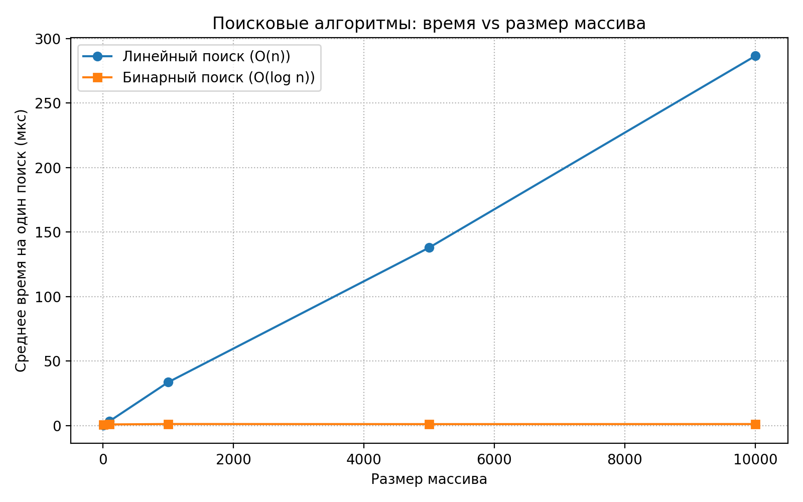
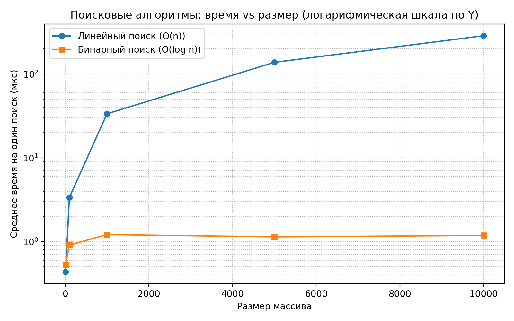
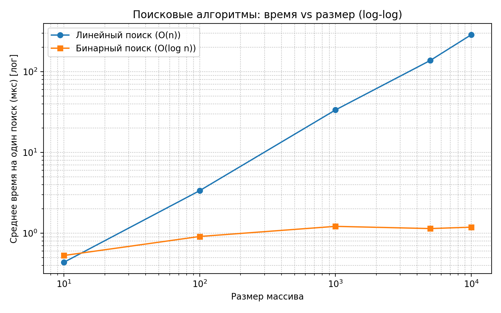

# Отчет по лабораторной работе 01
# Введение в алгоритмы. Сложность. Поиск.

**Дата:** 2025-09-22
**Семестр:** 5
**Группа:** ПИЖ-б-о-23-1
**Дисциплина:** Анализ сложности алгоритмов
**Студент:** Астраков Борис Александрович

## Цель работы
Освоить понятие вычислительной сложности алгоритма. Получить практические навыки
реализации и анализа линейного и бинарного поиска. Научиться экспериментально подтверждать
теоретические оценки сложности O(n) и O(log n).

## Теоретическая часть
**Сложность алгоритма** характеризует количество ресурсов (времени и памяти), необходимых
алгоритму для обработки входных данных объема n. **Асимптотический анализ** показывает поведение алгоритма при стремлении n к бесконечности и позволяет абстрагироваться от констант и аппаратных особенностей. **O-нотация («О-большое»)** - верхняя асимптотическая оценка роста функции. Определяет наихудший сценарий работы алгоритма. **Линейный поиск (Linear Search)** - последовательный перебор всех элементов массива, сложность O(n). **Бинарный поиск (Binary Search)** - поиск в отсортированном массиве путем многократного деления интервала поиска пополам, сложность O(log n), требует предварительной сортировки (O(n log n)).

## Практическая часть

### Выполненные задачи
- Задача 1: Реализовать функцию линейного поиска элемента в массиве.
- Задача 2: Реализовать функцию бинарного поиска элемента в отсортированном массиве.
- Задача 3: Провести теоретический анализ сложности обоих алгоритмов.
- Задача 4: Экспериментально сравнить время выполнения алгоритмов на массивах разного размера.
- Задача 5: Визуализировать результаты, подтвердив асимптотику O(n) и O(log n).

### Ключевые фрагменты кода

Линейный поиск:
```python
def linear_search(arr: List[int], target: int) -> int:  # O(1)
    """Вернуть индекс целевого элемента в массиве или -1, если не найден."""  # O(1)
    for index, value in enumerate(arr):  # O(n) за n итераций; одна итерация O(1)
        if value == target:  # O(1)
            return index  # O(1)
    return -1  # O(1)
    # Итоговая сложность: O(n) по времени, O(1) по дополнительной памяти
```

Бинарный поиск:
```python
def binary_search(arr: List[int], target: int) -> int:  # O(1)
    """Вернуть индекс целевого элемента в отсортированном массиве или -1, если не найден."""  # O(1)
    left = 0  # O(1)
    right = len(arr) - 1  # O(1)
    while left <= right:  # O(log n) итераций; тело цикла O(1)
        mid = (left + right) // 2  # O(1)
        mid_value = arr[mid]  # O(1)
        if mid_value == target:  # O(1)
            return mid  # O(1)
        if mid_value < target:  # O(1)
            left = mid + 1  # O(1)
        else:  # O(1)
            right = mid - 1  # O(1)
    return -1  # O(1)
    # Итоговая сложность: O(log n) по времени, O(1) по дополнительной памяти
```

## Результаты выполнения

### Пример работы программы

При запуске main.py открывается 3 окна с графиками, в консоль выводится сообщение об успешном выполнении скрипта (процесса).

## Выводы
1. Линейный поиск растёт примерно линейно с размером массива.
2. Бинарный поиск растёт очень медленно (логарифмически), поэтому на линейной шкале значения малы; для корректного сравнения добавлены логарифмические шкалы и адаптивные замеры времени.

## Ответы на контрольные вопросы
**1. Что такое асимптотическая сложность алгоритма и зачем она нужна?** - Ответ: Асимптотическая сложность — оценка роста времени/памяти алгоритма при увеличении размера входных данных. Нужна для сравнения эффективности алгоритмов при больших объёмах данных.
**2. Объясните разницу между O(1), O(n) и O(log n). Приведите примеры алгоритмов с такой сложностью.** - Ответ: O(1) — константное время (независимо от n). Пример: доступ к элементу массива по индексу. O(n) — линейное время. Пример: линейный поиск в неотсортированном массиве. O(log n) — логарифмическое время. Пример: бинарный поиск в отсортированном массиве.
**3. В чем основное отличие линейного поиска от бинарного? Какие предварительные условия необходимы для выполнения бинарного поиска?** - Ответ: Линейный поиск проверяет элементы по порядку; бинарный — делит отсортированный массив пополам. Условие для бинарного поиска: данные должны быть отсортированы.
**4. Почему на практике время выполнения алгоритма может отличаться от теоретической оценки O-большое?** - Ответ: Практическое время зависит от константных множителей, кэширования, архитектуры CPU, реализации языка, особенностей входных данных.
**5. Как экспериментально подтвердить, что сложность алгоритма равна O(n) или O(log n)? Опишите план эксперимента.** - Ответ: Запустить алгоритм на входах разного размера n (например, 10³, 10⁴, ..., 10⁶), измерить время выполнения T(n).
Для O(n): проверить, растёт ли T(n) ≈ линейно (T(n)/n ≈ const). Для O(log n): проверить, растёт ли T(n) ≈ как log n (T(n)/log n ≈ const). Построить график T(n) vs n и сравнить с теоретической кривой.

## Приложения





