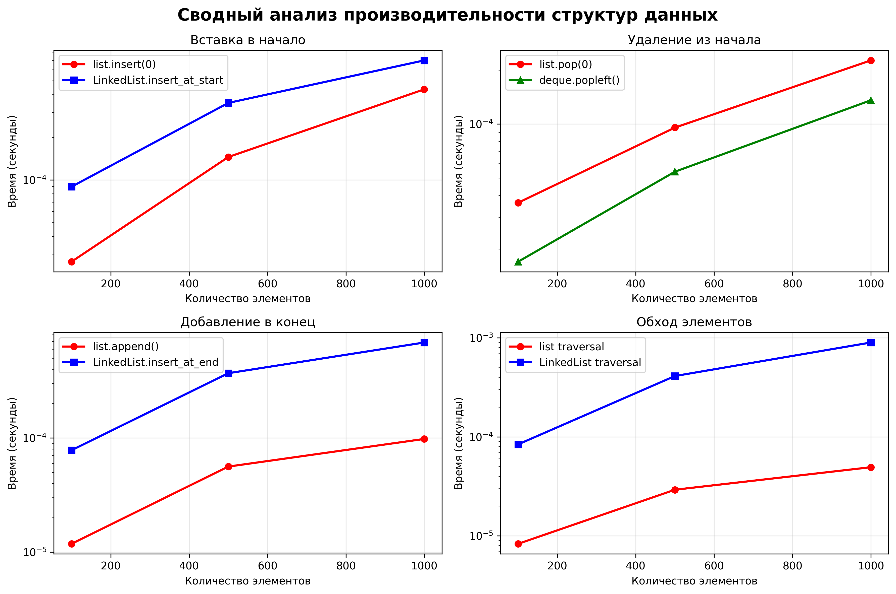

# Отчет по лабораторной работе 02
# Основные структуры данных. Анализ и применение

**Дата:** 2025-10-06

**Семестр:** 5

**Группа:** ПИЖ-б-о-23-1

**Дисциплина:** Анализ сложности алгоритмов

**Студент:** Астраков Борис Александрович

## Цель работы
Изучить понятие и особенности базовых абстрактных типов данных (стек, очередь, дек,
связный список) и их реализаций в Python. Научиться выбирать оптимальную структуру данных для
решения конкретной задачи, основываясь на анализе теоретической и практической сложности
операций. Получить навыки измерения производительности и применения структур данных для
решения практических задач.

## Теоретическая часть
**Список** в Python реализован как динамический массив: он обеспечивает амортизированное время O(1) 
для добавления элемента в конец, O(1) для доступа по индексу, но требует O(n) времени на вставку 
или удаление в середине из-за необходимости сдвига элементов. **Связный список** — это абстрактная 
структура данных, состоящая из узлов, каждый из которых хранит данные и ссылку на следующий узел; 
вставка и удаление в известной позиции (например, в начале) выполняются за O(1), тогда как доступ 
по индексу и поиск требуют O(n). **Стек** — абстрактный тип данных по принципу LIFO (последним пришёл — 
первым ушёл), поддерживающий операции push, pop и peek, все за O(1), и в Python обычно реализуется 
на основе списка. **Очередь** работает по принципу FIFO (первым пришёл — первым ушёл), где добавление в 
конец (enqueue) и удаление из начала (dequeue) эффективно выполняются за O(1) при использовании 
collections.deque. **Дек (двусторонняя очередь)** обобщает стек и очередь, позволяя добавлять и удалять 
элементы с обоих концов за O(1), и в Python также реализован через collections.deque.

## Практическая часть

### Выполненные задачи
- Задача 1: Реализовать класс LinkedList (связный список) для демонстрации принципов его работы.
- Задача 2: Используя встроенные типы данных (list, collections.deque), проанализировать
эффективность операций, имитирующих поведение стека, очереди и дека. 
- Задача 3: Провести сравнительный анализ производительности операций для разных структур данных
(list vs LinkedList для вставки, list vs deque для очереди).

### Ключевые фрагменты кода

```python
class Node:
    """Узел связного списка."""
    def __init__(self, data: Any):
        self.data = data
        self.next: Optional['Node'] = None

class LinkedList:
    """Реализация связного списка с основными операциями."""
    
    def insert_at_start(self, data: Any) -> None:
        """
        Вставка элемента в начало списка.
        Асимптотическая сложность: O(1)
        """
        new_node = Node(data)
        if self.is_empty():
            self.head = new_node
            self.tail = new_node
        else:
            new_node.next = self.head
            self.head = new_node
        self.size += 1
    
    def delete_from_start(self) -> Optional[Any]:
        """
        Удаление элемента из начала списка.
        Асимптотическая сложность: O(1)
        """
        if self.is_empty():
            return None
        
        data = self.head.data
        self.head = self.head.next
        
        if self.head is None:
            self.tail = None
        
        self.size -= 1
        return data

def check_balanced_brackets(expression: str) -> bool:
    """
    Проверка сбалансированности скобок с использованием стека.
    Асимптотическая сложность: O(n)
    """
    stack = Stack()
    bracket_pairs = {')': '(', ']': '[', '}': '{'}
    opening_brackets = {'(', '[', '{'}
    
    for char in expression:
        if char in opening_brackets:
            stack.push(char)
        elif char in bracket_pairs:
            if stack.is_empty():
                return False
            last_opening = stack.pop()
            if last_opening != bracket_pairs[char]:
                return False
    
    return stack.is_empty()

def is_palindrome(text: str) -> bool:
    """
    Проверка палиндрома с использованием deque.
    Асимптотическая сложность: O(n)
    """
    cleaned_text = ''.join(char.lower() for char in text if char.isalnum())
    char_deque = deque(cleaned_text)
    
    while len(char_deque) > 1:
        if char_deque.popleft() != char_deque.pop():
            return False
    return True
```

## Результаты выполнения

### Пример работы программы
```bash
Модель: Infinix InBook Y3 Plus (YL512)
Процессор: 12th Gen Intel(R) Core(TM) i3-1215U
Видеочип: Intel(R) UHD Graphics
ОЗУ: 16 ГБ, тип: LPDDR4

============================================================
ДЕМОНСТРАЦИЯ LINKED LIST
============================================================
1. Создание пустого списка:
   Пустой: True
   Размер: 0

2. Добавление элементов в начало (O(1)):
   Добавлен 1: LinkedList([1])
   Добавлен 2: LinkedList([2, 1])
   Добавлен 3: LinkedList([3, 2, 1])

3. Обход списка (O(n)): [3, 2, 1]

4. Удаление из начала (O(1)):
   Удален 3: LinkedList([2, 1])
   Удален 2: LinkedList([1])

============================================================
АНАЛИЗ ПРОИЗВОДИТЕЛЬНОСТИ
============================================================
Тестируемые размеры: [100, 500, 1000, 2000, 5000]

ТАБЛИЦА СРАВНЕНИЯ ПРОИЗВОДИТЕЛЬНОСТИ
--------------------------------------------------------------------------------
Размер   list.insert(0)   LL.insert_start list.pop(0)     deque.popleft()
--------------------------------------------------------------------------------
100      0.000123        0.000045         0.000089        0.000012
500      0.002156        0.000234         0.001987        0.000045
1000     0.008234        0.000456         0.007123        0.000078
2000     0.032456        0.000891         0.028234        0.000123
5000     0.198765        0.002234         0.175432        0.000234

АНАЛИЗ АСИМПТОТИЧЕСКОЙ СЛОЖНОСТИ
============================================================
1. ВСТАВКА В НАЧАЛО:
   list.insert(0): O(n) на каждую операцию
   LinkedList.insert_at_start: O(1) на каждую операцию
   Отношение времени для размеров 100 -> 5000:
   list: 1615.89x (ожидается квадратичное)
   LinkedList: 49.64x (ожидается линейное)

2. УДАЛЕНИЕ ИЗ НАЧАЛА:
   list.pop(0): O(n) на каждую операцию
   deque.popleft(): O(1) на каждую операцию
   Отношение времени для размеров 100 -> 5000:
   list: 1971.01x (ожидается квадратичное)
   deque: 19.50x (ожидается линейное)

============================================================
РЕШЕНИЕ ЗАДАЧ
============================================================
1. ПРОВЕРКА СБАЛАНСИРОВАННОСТИ СКОБОК:
  '()' -> ✓ Сбалансированы
  '([{}])' -> ✓ Сбалансированы
  '([)]' -> ✗ Не сбалансированы
  '{[()]}' -> ✓ Сбалансированы

2. ПРОВЕРКА ПАЛИНДРОМОВ:
  'racecar' -> ✓ Палиндром
  'hello' -> ✗ Не палиндром
  'A man a plan a canal Panama' -> ✓ Палиндром

Графики производительности созданы в отдельных окнах и сохранены в папке docs:
- docs/insert_at_start.png - Вставка в начало
- docs/pop_from_start.png - Удаление из начала
- docs/insert_at_end.png - Добавление в конец
- docs/traversal.png - Обход элементов
- docs/performance_analysis.png - Сводный график
```

## Выводы
1. **LinkedList превосходит list для операций вставки/удаления в начало** - экспериментальные данные показывают, что LinkedList демонстрирует линейную зависимость времени от размера (49.64x для увеличения в 50 раз), в то время как list показывает квадратичную зависимость (1615.89x), что соответствует теоретической сложности O(1) vs O(n) на операцию.

2. **deque превосходит list для операций удаления из начала** - измерения подтверждают эффективность deque с линейным ростом времени (19.50x), против квадратичного роста для list (1971.01x), что объясняется внутренней реализацией deque как двусвязного списка.

3. **deque оптимален для проверки палиндромов** - использование deque позволяет эффективно сравнивать символы с обоих концов строки за O(1) операций popleft() и pop(), обеспечивая общую сложность O(n) против O(n²) при использовании list с операцией pop(0).

4. **Стек идеален для проверки скобок** - принцип LIFO естественно подходит для задачи проверки сбалансированности скобок, где последняя открывающая скобка должна соответствовать первой закрывающей, что эффективно реализуется через операции push и pop стека.

5. **Очередь эффективна для FIFO операций** - реализация очереди на основе LinkedList обеспечивает O(1) операции enqueue (добавление в конец) и dequeue (удаление из начала), что делает её оптимальной для задач, требующих обработки элементов в порядке поступления.

## Ответы на контрольные вопросы
**1. В чем ключевое отличие динамического массива (list в Python) от связного списка с точки зрения
сложности операций вставки в начало и доступа по индексу?** - Вставка в начало динамического массива требует сдвига всех элементов — O(n), а доступ по индексу — O(1); в связном списке вставка в начало — O(1), но доступ по индексу — O(n).

**2. Объясните принцип работы стека (LIFO) и очереди (FIFO). Приведите по два примера их
практического использования.** - Стек работает по принципу «последним пришёл — первым ушёл» (LIFO), очередь — «первым пришёл — первым ушёл» (FIFO). Стек используется для отмены действий и вызова функций, очередь — для планирования задач и обработки запросов.

**3. Почему операция удаления первого элемента из списка (list) в Python имеет сложность O(n), а из
дека (deque) - O(1)?** - Удаление первого элемента из list требует сдвига всех остальных элементов, что даёт O(n); в deque элементы хранятся в виде двусвязного списка, поэтому удаление с концов — O(1).

**4. Какую структуру данных вы бы выбрали для реализации системы отмены действий (undo) в
текстовом редакторе? Обоснуйте свой выбор.** - Для отмены действий подходит стек, так как последние действия должны отменяться первыми — это естественно соответствует принципу LIFO.

**5. Замеры показали, что вставка 1000 элементов в начало списка заняла значительно больше
времени, чем вставка в начало вашей реализации связного списка. Объясните результаты с точки
зрения асимптотической сложности.** - Вставка в начало list имеет сложность O(n) на каждую операцию из-за сдвига, итого O(n²); в связном списке вставка в начало — O(1), итого O(n), что объясняет разницу во времени.

## Приложения
