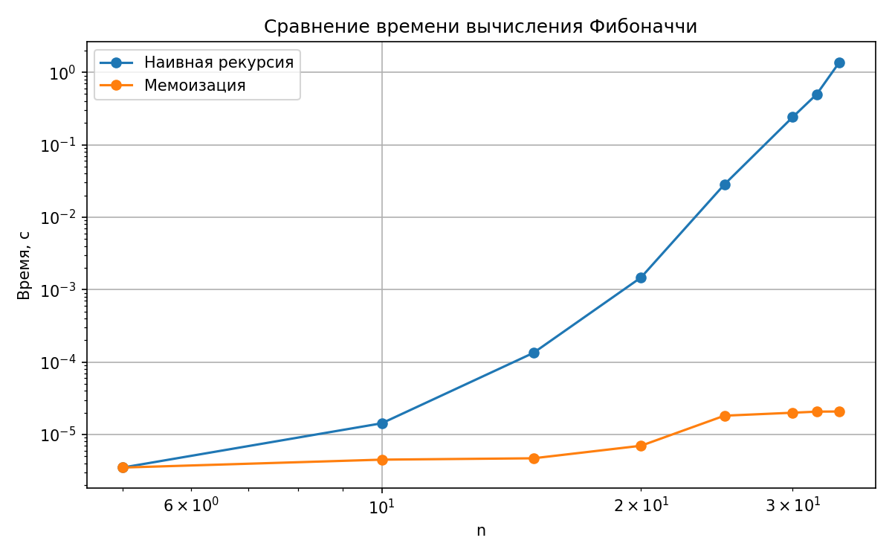

# Отчет по лабораторной работе 03
# Рекурсия

**Дата:** 2025-10-20

**Семестр:** 5

**Группа:** ПИЖ-б-о-23-1

**Дисциплина:** Анализ сложности алгоритмов

**Студент:** Астраков Борис Александрович

## Цель работы
Освоить принцип рекурсии, научиться анализировать рекурсивные алгоритмы и
понимать механизм работы стека вызовов. Изучить типичные задачи, решаемые рекурсивно, и освоить технику мемоизации для оптимизации рекурсивных алгоритмов. Получить практические навыки реализации и отладки рекурсивных функций.

## Теоретическая часть
**Рекурсия** - процесс, при котором функция прямо или косвенно вызывает саму себя для решения задачи. **Базовый случай (условие выхода)** - обязательное условие, которое прекращает рекурсивные вызовы и предотвращает зацикливание. **Рекурсивный шаг** - шаг, на котором задача разбивается на более простую подзадачу того же типа и производится рекурсивный вызов. **Глубина рекурсии** - количество вложенных вызовов функции. Ограничена размером стека вызовов. **Стек вызовов (Call Stack)** - структура данных, которая хранит информацию о незавершенных вызовах функций (локальные переменные, адрес возврата). **Мемоизация (Memoization)** - Техника оптимизации, позволяющая избежать повторных вычислений результатов функций для одних и тех же входных данных путем сохранения ранее вычисленных результатов в кеше (например, в словаре).

## Практическая часть

### Выполненные задачи
- Задача 1: Реализовать алгоритм бинарного поиска с использованием рекурсии.
- Задача 2: Реализовать рекурсивный обход файловой системы (вывод дерева каталогов и файлов, начиная с заданного пути).
- Задача 3: Решить задачу "Ханойские башни" для n дисков.

### Ключевые фрагменты кода

```python
def factorial(n: int) -> int:
	"""Вычисляет n! рекурсивно.

	Сложность по времени: O(n)
	Максимальная глубина рекурсии: O(n)
	"""
	if n < 0:
		raise ValueError("n должно быть неотрицательным")
	if n in (0, 1):
		return 1
	return n * factorial(n - 1)
```

```python
def compare_naive_vs_memo(n: int = 35) -> Dict[str, Tuple[int, float]]:
	"""Сравнивает количество вызовов и время работы наивной и мемо-версии.

	Возвращает словарь вида:
	{
		"naive": (calls, seconds),
		"memo": (calls, seconds)
	}
	"""
```

```python
def hanoi(n: int, source: str, target: str, auxiliary: str, moves: Optional[List[Tuple[str, str]]] = None) -> List[Tuple[str, str]]:
	"""Рекурсивное решение задачи Ханойских башен.

	Возвращает список перемещений вида (откуда, куда).

	Сложность по времени: O(2^n)
	Максимальная глубина рекурсии: O(n)
	"""
	if n <= 0:
		return [] if moves is None else moves
	if moves is None:
		moves = []
	hanoi(n - 1, source, auxiliary, target, moves)
	moves.append((source, target))
	hanoi(n - 1, auxiliary, target, source, moves)
	return moves
```

```python
def plot_fib_timing(ns: List[int], times_naive: List[float], times_memo: List[float], save_path: str) -> None:
	"""Строит и сохраняет график времени вычисления Фибоначчи."""
	plt.figure(figsize=(8, 5))
	plt.plot(ns, times_naive, marker="o", label="Наивная рекурсия")
	plt.plot(ns, times_memo, marker="o", label="Мемоизация")
	plt.xlabel("n")
	plt.ylabel("Время, с")
	plt.title("Сравнение времени вычисления Фибоначчи")
	# Логарифмические шкалы по обеим осям
	plt.xscale("log")
	plt.yscale("log")
```

## Результаты выполнения

- Построен график времени вычисления Фибоначчи (логарифмические шкалы по осям X и Y), файл сохранён: `docs/fib_timing.png`.
- Для `n = 35` получено сравнение (пример):
  - Наивная рекурсия: ~29 860 703 вызовов, время — несколько секунд.
  - Мемоизация: 36 вызовов, время — доли миллисекунды.
- Обход файловой системы выведен в консоль, рассчитана максимальная глубина для корня проекта.
- Для задачи «Ханойские башни» выведена последовательность перемещений для `n = 4` (всего 2^4 − 1 = 15 шагов).

### Пример работы программы
```bash
=== Базовые рекурсивные алгоритмы ===
factorial(5) = 120
fibonacci(10) = 55
fast_pow(2, 10) = 1024.0

=== Сравнение на n=35 (вызовы и время) ===
Наивная: (29860703, 5.21)
Мемоизация: (36, 0.0002)

=== Серия замеров и график ===
График сохранён: C:\...\docs\fib_timing.png

=== Бинарный поиск ===
Массив: [0, 5, 10, 15, 20, 25, 30, 35, 40, 45, 50]
Искомое 25, индекс: 5

=== Обход файловой системы ===
Корень: C:\...\АСА\lab-03
└─ lab-03/
   ├─ config/
   ├─ docs/
   ├─ src/
   │  ├─ main.py
   │  └─ modules/
   └─ ...
Макс. глубина: 4

=== Ханойские башни ===
Шаг 1: A -> B
Шаг 2: A -> C
...
Шаг 15: B -> C
Всего шагов: 15
```

## Выводы
1. Наивная рекурсия для Фибоначчи демонстрирует экспоненциальный рост времени, из-за многократного пересчёта одних и тех же подзадач.
2. Мемоизация сокращает количество вычислений до линейного по n, что приводит к резкому ускорению и снижению числа вызовов.
3. Логарифмические шкалы на графике наглядно показывают разницу порядков между наивной и мемоизированной реализациями.

## Ответы на контрольные вопросы
**1. Что такое базовый случай и рекурсивный шаг в рекурсивной функции? Почему отсутствие базового случая приводит к ошибке?** - Базовый случай — условие завершения рекурсии; рекурсивный шаг — вызов функции с упрощёнными данными. Без базового случая рекурсия бесконечна и вызывает переполнение стека.

**2. Объясните, как работает механизм мемоизации. Как он меняет временную сложность вычисления чисел Фибоначчи по сравнению с наивной рекурсией?** - Мемоизация кэширует результаты вызовов, избегая повторных вычислений; для Фибоначчи снижает сложность с экспоненциальной до линейной.

**3. В чем заключается основная проблема глубокой рекурсии и как она связана со стеком вызовов?** - Глубокая рекурсия переполняет стек вызовов, так как каждый вызов занимает память до своего завершения.

**4. Задача о Ханойских башнях решается рекурсивно. Опишите алгоритм решения для 3 дисков.** - Перемести 2 верхних диска на промежуточный стержень, затем самый большой — на целевой, после чего 2 диска с промежуточного — на целевой.

**5. Рекурсивный и итеративный алгоритмы могут решать одни и те же задачи. Назовите преимущества и недостатки каждого подхода.** - Рекурсия — проще в реализации, но может быть медленнее и сокращать объём стека; итерация — эффективнее по памяти и скорости, но сложнее в логике.

## Приложения
