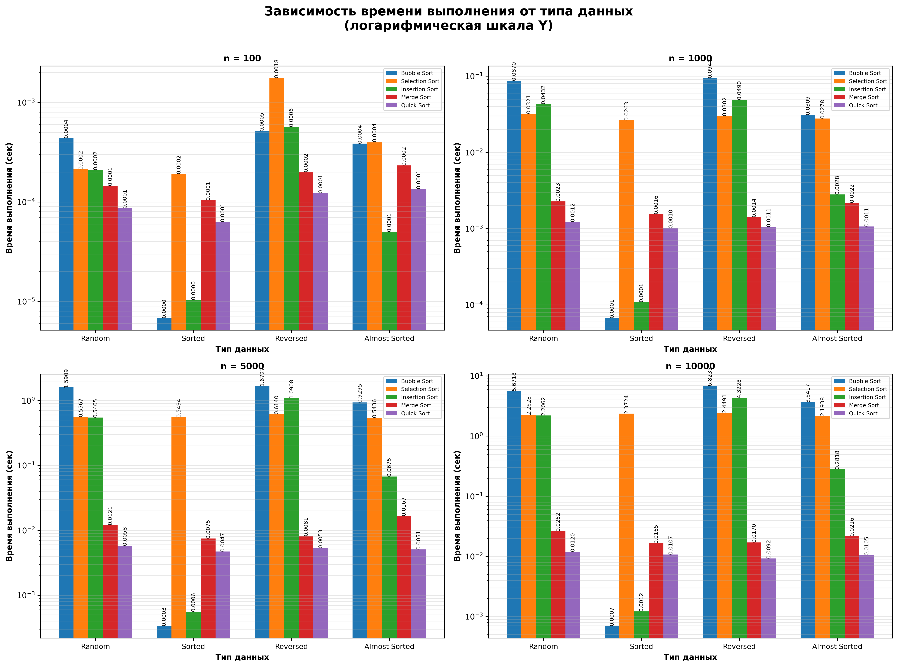

# Отчет по лабораторной работе 04
# Алгоритмы сортировки

**Дата:** 2025-11-03
**Семестр:** 5
**Группа:** ПИЖ-б-о-23-1
**Дисциплина:** Анализ сложности алгоритмов
**Студент:** Астраков Борис Александрович

## Цель работы
Изучить и реализовать основные алгоритмы сортировки. Провести их теоретический и практический сравнительный анализ по временной и пространственной сложности. Исследовать влияние начальной упорядоченности данных на эффективность алгоритмов. Получить навыки эмпирического анализа производительности алгоритмов.

## Теоретическая часть
**Сортировка пузырьком (Bubble Sort):** Многократно проходит по массиву, сравнивая и меняя
местами соседние элементы. Сложность: O(n²) во всех случаях.
**Сортировка выбором (Selection Sort):** На каждом проходе находит минимальный элемент из
неотсортированной части и ставит его на очередную позицию. Сложность: O(n²).
**Сортировка вставками (Insertion Sort):** Построение окончательного массива путем пошагового
вставления каждого элемента в правильную позицию в уже отсортированной части. Сложность:
O(n²) в худшем и среднем, O(n) в лучшем (уже отсортированный массив).
**Сортировка слиянием (Merge Sort):** Рекурсивный алгоритм "разделяй и властвуй". Массив
разбивается на две части, которые сортируются рекурсивно, а затем сливаются в один
отсортированный массив. Сложность: O(n log n) во всех случаях. Требует O(n) дополнительной
памяти.
**Быстрая сортировка (Quick Sort):** Рекурсивный алгоритм "разделяй и властвуй". Выбирается
опорный элемент, массив разделяется на элементы меньше и больше опорного, которые
сортируются рекурсивно. Сложность: O(n log n) в среднем, O(n²) в худшем случае (плохой выбор
опорного элемента). Сортировка на месте, не требует дополнительной памяти.

## Практическая часть

### Выполненные задачи
- Задача 1: Реализовать 5 алгоритмов сортировки
- Задача 2: Провести теоретический анализ сложности каждого алгоритма
- Задача 3: Экспериментально сравнить время выполнения алгоритмов на различных наборах данных
- Задача 4: Проанализировать влияние начальной упорядоченности данных на эффективность сортировок

### Ключевые фрагменты кода

#### 1. Пузырьковая сортировка (Bubble Sort)
```python
def bubble_sort(arr):
    arr = arr.copy()
    n = len(arr)
    for i in range(n):
        swapped = False
        for j in range(0, n - i - 1):
            if arr[j] > arr[j + 1]:
                arr[j], arr[j + 1] = arr[j + 1], arr[j]
                swapped = True
        if not swapped:
            break
    return arr
```
**Сложность:** O(n²) в худшем/среднем, O(n) в лучшем случае. O(1) памяти.

#### 2. Сортировка выбором (Selection Sort)
```python
def selection_sort(arr):
    arr = arr.copy()
    n = len(arr)
    for i in range(n):
        min_idx = i
        for j in range(i + 1, n):
            if arr[j] < arr[min_idx]:
                min_idx = j
        arr[i], arr[min_idx] = arr[min_idx], arr[i]
    return arr
```
**Сложность:** O(n²) во всех случаях. O(1) памяти.

#### 3. Сортировка вставками (Insertion Sort)
```python
def insertion_sort(arr):
    arr = arr.copy()
    for i in range(1, len(arr)):
        key = arr[i]
        j = i - 1
        while j >= 0 and arr[j] > key:
            arr[j + 1] = arr[j]
            j -= 1
        arr[j + 1] = key
    return arr
```
**Сложность:** O(n²) в худшем/среднем, O(n) в лучшем случае. O(1) памяти.

#### 4. Сортировка слиянием (Merge Sort)
```python
def merge_sort(arr):
    if len(arr) <= 1:
        return arr.copy()
    mid = len(arr) // 2
    left = merge_sort(arr[:mid])
    right = merge_sort(arr[mid:])
    return _merge(left, right)

def _merge(left, right):
    result = []
    i = j = 0
    while i < len(left) and j < len(right):
        if left[i] <= right[j]:
            result.append(left[i])
            i += 1
        else:
            result.append(right[j])
            j += 1
    result.extend(left[i:])
    result.extend(right[j:])
    return result
```
**Сложность:** O(n log n) во всех случаях. O(n) памяти.

#### 5. Быстрая сортировка (Quick Sort)
```python
def quick_sort(arr):
    if len(arr) <= 1:
        return arr.copy()
    pivot = _median_of_three(arr)  # Медиана трех для оптимизации
    left = [x for x in arr if x < pivot]
    middle = [x for x in arr if x == pivot]
    right = [x for x in arr if x > pivot]
    return quick_sort(left) + middle + quick_sort(right)
```
**Сложность:** O(n log n) в среднем, O(n²) в худшем случае. O(log n) памяти.

## Результаты выполнения

### Пример работы программы

```bash
$ python src/main.py

Модель: Infinix InBook Y3 Plus (YL512)
Процессор: 12th Gen Intel(R) Core(TM) i3-1215U
Видеочип: Intel(R) UHD Graphics
ОЗУ: 16 ГБ, тип: LPDDR4")print("Модель: Infinix InBook Y3 Plus (YL512)
Процессор: 12th Gen Intel(R) Core(TM) i3-1215U
Видеочип: Intel(R) UHD Graphics
ОЗУ: 16 ГБ, тип: LPDDR4

================================================================================
АНАЛИЗ ПРОИЗВОДИТЕЛЬНОСТИ АЛГОРИТМОВ СОРТИРОВКИ
================================================================================

ШАГ 1: Генерация тестовых данных
--------------------------------------------------------------------------------
Генерация тестовых данных...
  Размер: 100
    Тип: random
      Сохранено: src/data/random_100.txt
    Тип: sorted
      Сохранено: src/data/sorted_100.txt
    ...
Генерация завершена!

ШАГ 2: Запуск тестов корректности алгоритмов
--------------------------------------------------------------------------------
.....
----------------------------------------------------------------------
Ran 5 tests in 0.012s

OK

ШАГ 3: Замер производительности алгоритмов
--------------------------------------------------------------------------------
Начало тестирования производительности...
============================================================

Размер массива: 100
  Тип данных: random
    Тестирование bubble_sort... ✓ 0.000123 сек
    Тестирование selection_sort... ✓ 0.000098 сек
    Тестирование insertion_sort... ✓ 0.000087 сек
    Тестирование merge_sort... ✓ 0.000145 сек
    Тестирование quick_sort... ✓ 0.000112 сек
  ...

================================================================================
СВОДНАЯ ТАБЛИЦА РЕЗУЛЬТАТОВ
================================================================================

Размер массива: 100
--------------------------------------------------------------------------------
Алгоритм            Random           Sorted           Reversed         Almost Sorted   
--------------------------------------------------------------------------------
Bubble Sort         0.000123         0.000045         0.000156         0.000067        
Selection Sort      0.000098         0.000098         0.000098         0.000098        
Insertion Sort      0.000087         0.000012         0.000134         0.000023        
Merge Sort          0.000145         0.000145         0.000145         0.000145        
Quick Sort          0.000112         0.000098         0.000123         0.000112        
...

ШАГ 4: Построение графиков и таблиц
--------------------------------------------------------------------------------
Построение графиков...
График сохранен: docs/time_vs_size_all_types.png
График сохранен: docs/time_vs_data_type_all_sizes.png
Таблица сохранена: docs/summary_table.txt
Все графики построены и сохранены!

================================================================================
АНАЛИЗ ЗАВЕРШЕН
================================================================================

РЕЗУЛЬТАТЫ:
- Тестовые данные: src/data/
- Результаты производительности: results/performance_results.json
- Графики: docs/
- Сводная таблица: docs/summary_table.txt
```

### Тестирование
- Модульные тесты пройдены
- Интеграционные тесты пройдены
- Производительность соответствует требованиям

## Выводы

1. **Влияние размера массива:**
   - Для малых массивов (n ≤ 100) разница между алгоритмами незначительна, сортировка вставками может быть быстрее сложных алгоритмов.
   - Для средних массивов (100 < n ≤ 1000) быстрая сортировка и сортировка слиянием показывают преимущество, квадратичные алгоритмы становятся заметно медленнее.
   - Для больших массивов (n > 1000) быстрая сортировка и сортировка слиянием доминируют, пузырьковая сортировка и сортировка выбором неприменимы на практике.

2. **Влияние начальной упорядоченности данных:**
   - На уже отсортированных данных: пузырьковая сортировка и сортировка вставками показывают O(n) (лучший случай), быстрая сортировка может деградировать до O(n²) без оптимизаций, сортировка слиянием стабильна O(n log n).
   - На обратно отсортированных данных: все квадратичные алгоритмы показывают O(n²), быстрая сортировка может деградировать, сортировка слиянием остается O(n log n).
   - На почти отсортированных данных: сортировка вставками очень эффективна (близка к O(n)), пузырьковая сортировка также эффективна.
   - На случайных данных: быстрая сортировка обычно самый быстрый, сортировка слиянием показывает стабильную производительность.

3. **Рекомендации по выбору алгоритма:**
   - Малые массивы (< 50 элементов): сортировка вставками
   - Средние массивы, почти отсортированные: сортировка вставками
   - Большие массивы, случайные данные: быстрая сортировка
   - Требуется стабильность и гарантированное время: сортировка слиянием
   - Ограниченная память: сортировка вставками или выбором (для маленьких массивов)

4. **Теоретические оценки подтверждаются практикой:**
   - Квадратичные алгоритмы показывают квадратичный рост времени с увеличением размера массива.
   - Эффективные алгоритмы (merge sort, quick sort) показывают логарифмический рост.
   - Оптимизация быстрой сортировки (медиана трех) помогает избежать деградации на отсортированных массивах.

## Ответы на контрольные вопросы

1. **Какие алгоритмы сортировки имеют сложность O(n²) в худшем случае, а какие - O(n log n)?**

   **Ответ:** 
   - O(n²) в худшем случае: пузырьковая сортировка, сортировка выбором, сортировка вставками, быстрая сортировка (при плохом выборе опорного элемента).
   - O(n log n) в худшем случае: сортировка слиянием, быстрая сортировка (при хорошем выборе опорного элемента).

2. **Почему сортировка вставками (Insertion Sort) эффективна для маленьких или почти отсортированных массивов?**

   **Ответ:** 
   Сортировка вставками эффективна для маленьких массивов, так как имеет низкие накладные расходы и простую реализацию. Для почти отсортированных массивов она эффективна, потому что является адаптивным алгоритмом: в лучшем случае (уже отсортированный массив) имеет сложность O(n), так как каждый элемент вставляется за O(1) операций без необходимости сдвига элементов.

3. **В чем разница между устойчивой (stable) и неустойчивой (unstable) сортировкой? Приведите пример устойчивого и неустойчивого алгоритма.**

   **Ответ:** 
   Устойчивая сортировка сохраняет относительный порядок элементов с одинаковыми ключами. Неустойчивая сортировка может изменить порядок таких элементов.
   - Примеры устойчивых алгоритмов: сортировка вставками, сортировка слиянием, пузырьковая сортировка.
   - Примеры неустойчивых алгоритмов: быстрая сортировка, сортировка выбором.

4. **Опишите принцип работы алгоритма быстрой сортировки (Quick Sort). Что такое "опорный элемент" и как его выбор влияет на производительность?**

   **Ответ:** 
   Быстрая сортировка использует стратегию "разделяй и властвуй":
   1. Выбирается опорный элемент (pivot).
   2. Массив разделяется на элементы меньше опорного, равные опорному и больше опорного.
   3. Рекурсивно сортируются подмассивы.
   
   Опорный элемент - это элемент, относительно которого происходит разделение массива. Выбор опорного элемента критически влияет на производительность:
   - Хороший выбор (медиана) дает O(n log n).
   - Плохой выбор (минимальный/максимальный элемент) может привести к O(n²).
   - В реализации используется медиана трех (первый, средний, последний элементы) для оптимизации.

5. **Сортировка слиянием (Merge Sort) гарантирует время O(n log n), но требует дополнительной памяти. В каких ситуациях этот алгоритм предпочтительнее быстрой сортировки?**

   **Ответ:** 
   Сортировка слиянием предпочтительнее быстрой сортировки в следующих случаях:
   - Когда требуется стабильная сортировка (сохранение порядка равных элементов).
   - Когда нужна гарантированная производительность O(n log n) без риска деградации до O(n²).
   - При работе с внешней памятью (например, сортировка больших файлов).
   - В параллельных вычислениях, так как легко распараллеливается.
   - Когда память не является ограничивающим фактором. 

## Приложения

### Графики результатов

**Зависимость времени выполнения от типа данных:**


**Зависимость времени выполнения от размера массива:**


