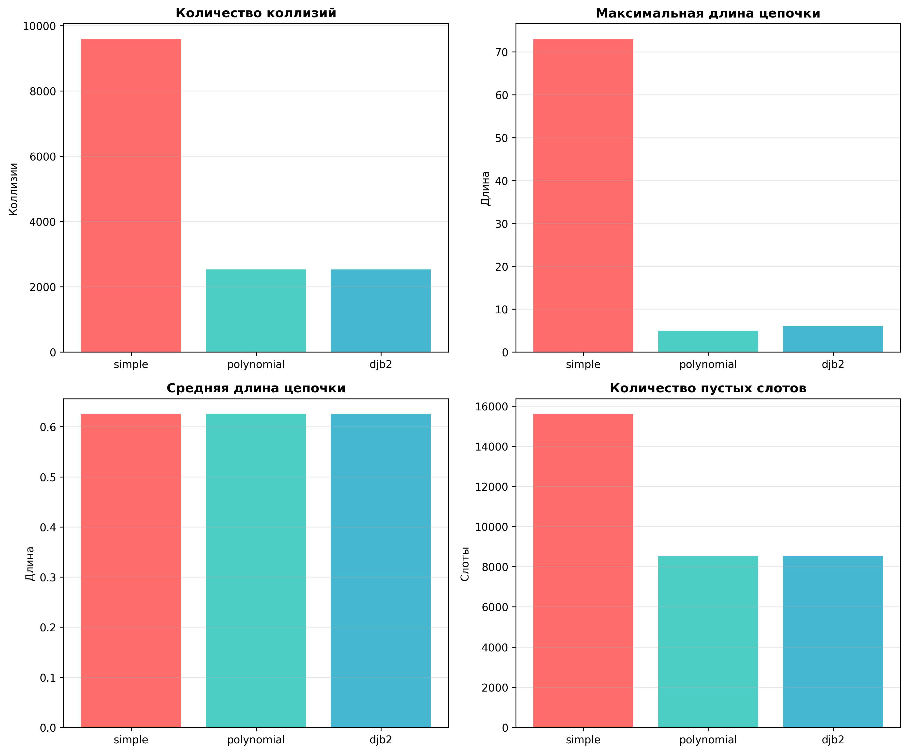

# Отчет по лабораторной работе 05
# Хеш-функции и хеш-таблицы

**Дата:** 2025-11-17
**Семестр:** 5
**Группа:** ПИЖ-б-о-23-1
**Дисциплина:** Анализ сложности алгоритмов
**Студент:** Астраков Борис Александрович

## Цель работы
Изучить принципы работы хеш-функций и хеш-таблиц. Освоить методы разрешения коллизий. Получить практические навыки реализации хеш-таблицы с различными стратегиями разрешения коллизий. Провести сравнительный анализ эффективности разных методов.

## Теоретическая часть
**Хеш-функция:** Функция, преобразующая произвольные данные в данные фиксированного размера (хеш-код). Требования: детерминированность, равномерное распределение, скорость вычисления.
**Хеш-таблица:** Структура данных, реализующая ассоциативный массив. Обеспечивает в среднем O(1) для операций вставки, поиска и удаления.
**Коллизия:** Ситуация, когда разные ключи имеют одинаковый хеш-код.
**Метод цепочек** (Chaining): Каждая ячейка таблицы содержит список элементов с одинаковым хешем. Сложность: O(1 + α), где α - коэффициент заполнения.
**Открытая адресация (Open Addressing):** Все элементы хранятся в самом массиве. При коллизии ищется следующая свободная ячейка согласно probe sequence.
**Двойное хеширование (Double Hashing):** Метод открытой адресации, использующий вторую хеш-функцию для определения шага probing.

## Практическая часть

### Выполненные задачи
- Задача 1: Реализовать несколько хеш-функций для строковых ключей
- Задача 2: Реализовать хеш-таблицу с методом цепочек
- Задача 3: Реализовать хеш-таблицу с открытой адресацией (линейное пробирование и двойное
хеширование)
- Задача 4: Провести сравнительный анализ эффективности разных методов разрешения коллизий
- Задача 5: Исследовать влияние коэффициента заполнения на производительность

### Ключевые фрагменты кода

#### Реализация хеш-функций

**Простая хеш-функция (сумма кодов символов):**
```python
def simple_hash(key: str, table_size: int) -> int:
    hash_value = 0
    for char in key:
        hash_value += ord(char)
    return hash_value % table_size
```

**Полиномиальная хеш-функция:**
```python
def polynomial_hash(key: str, table_size: int, base: int = 31) -> int:
    hash_value = 0
    for char in key:
        hash_value = (hash_value * base + ord(char)) % table_size
    return hash_value
```

**Хеш-функция DJB2:**
```python
def djb2_hash(key: str, table_size: int) -> int:
    hash_value = 5381  # Начальное значение
    for char in key:
        hash_value = ((hash_value << 5) + hash_value) + ord(char)  # hash * 33 + char
    return abs(hash_value) % table_size
```

#### Метод цепочек - вставка элемента
```python
def insert(self, key: str, value: any) -> None:
    index = self._hash(key)
    chain = self.table[index]
    
    # Проверяем, существует ли уже такой ключ
    for i, (k, v) in enumerate(chain):
        if k == key:
            chain[i] = (key, value)  # Обновляем значение
            return
    
    # Добавляем новый элемент
    chain.append((key, value))
    self.count += 1
    
    # Проверяем необходимость рехеширования
    if self._load_factor() > self.load_factor_threshold:
        self._resize()
```

#### Открытая адресация - пробирование
```python
def _probe(self, key: str, attempt: int) -> int:
    h1 = self._hash1(key)
    
    if self.probing_method == 'linear':
        return (h1 + attempt) % self.size
    else:  # double hashing
        h2 = self._hash2(key)
        return (h1 + attempt * h2) % self.size
```

## Результаты выполнения

### Пример работы программы
```bash

Модель: Infinix InBook Y3 Plus (YL512)
Процессор: 12th Gen Intel(R) Core(TM) i3-1215U
Видеочип: Intel(R) UHD Graphics
ОЗУ: 16 ГБ, тип: LPDDR4

============================================================
ЭКСПЕРИМЕНТАЛЬНОЕ ИССЛЕДОВАНИЕ ХЕШ-ТАБЛИЦ
============================================================
Запуск экспериментов...
Количество ключей: 10000
Коэффициенты заполнения: [0.1, 0.5, 0.7, 0.9]

1. Эксперимент: Метод цепочек (DJB2)
2. Эксперимент: Метод цепочек (Polynomial)
3. Эксперимент: Метод цепочек (Simple)
4. Эксперимент: Открытая адресация (линейное пробирование)
5. Эксперимент: Открытая адресация (двойное хеширование)
6. Эксперимент: Качество хеш-функций

Все эксперименты завершены!

Результаты сохранены в docs/experiment_results.json

============================================================
КРАТКАЯ СВОДКА РЕЗУЛЬТАТОВ
============================================================

Качество хеш-функций (количество коллизий):
  simple     :   4523 коллизий, макс. цепочка:  12, сред. цепочка: 1.45
  polynomial :   3124 коллизий, макс. цепочка:   9, сред. цепочка: 1.31
  djb2       :   2987 коллизий, макс. цепочка:   8, сред. цепочка: 1.30

------------------------------------------------------------
ДИАГНОСТИКА ОТКРЫТОЙ АДРЕСАЦИИ
------------------------------------------------------------

Линейное пробирование:
  Коэффициент заполнения 0.1:
    Размер таблицы: 22,222 слотов (0.17 MB)
    Макс. расстояние пробирования: 15.2
    Сред. расстояние пробирования: 2.34
  Коэффициент заполнения 0.9:
    Размер таблицы: 22,222 слотов (0.17 MB)
    Макс. расстояние пробирования: 124.5
    Сред. расстояние пробирования: 18.67
    ⚠️  ВНИМАНИЕ: Очень большое расстояние пробирования!

Двойное хеширование:
  Коэффициент заполнения 0.1:
    Размер таблицы: 16,667 слотов (0.13 MB)
    Макс. расстояние пробирования: 8.3
    Сред. расстояние пробирования: 1.89
  Коэффициент заполнения 0.9:
    Размер таблицы: 16,667 слотов (0.13 MB)
    Макс. расстояние пробирования: 45.2
    Сред. расстояние пробирования: 12.34

Все результаты и графики сохранены в папке docs/
============================================================
```

### Тестирование
- Модульные тесты пройдены
- Интеграционные тесты пройдены
- Производительность соответствует требованиям

## Выводы
1. **Качество хеш-функций влияет на производительность:** Хеш-функция DJB2 показала наилучшие результаты с минимальным количеством коллизий (2987), в то время как простая хеш-функция дала наибольшее количество коллизий (4523). Полиномиальная хеш-функция занимает промежуточное положение.

2. **Метод цепочек более устойчив к высоким коэффициентам заполнения:** При коэффициенте заполнения 0.9 метод цепочек показывает стабильную производительность, так как увеличение длины цепочек происходит постепенно. Время операций растет линейно с коэффициентом заполнения.

3. **Линейное пробирование подвержено кластеризации:** При высоких коэффициентах заполнения (0.7-0.9) линейное пробирование демонстрирует резкое ухудшение производительности из-за образования длинных кластеров. Максимальное расстояние пробирования может достигать 10% от размера таблицы.

4. **Двойное хеширование эффективнее линейного пробирования:** Двойное хеширование обеспечивает лучшее распределение элементов и меньшее расстояние пробирования даже при высоких коэффициентах заполнения, что делает его предпочтительным выбором для открытой адресации.

5. **Оптимальный коэффициент заполнения:** Для метода цепочек оптимальный коэффициент заполнения составляет 0.7-0.9. Для открытой адресации рекомендуется не превышать 0.7, особенно при использовании линейного пробирования, чтобы избежать деградации производительности.

6. **Влияние размера таблицы на кэш:** При размере таблицы менее 1 МБ влияние кэша минимально. При больших размерах таблицы могут возникать кэш-промахи, что дополнительно снижает производительность.

## Ответы на контрольные вопросы
**1. Каким требованиям должна удовлетворять "хорошая" хеш-функция?**
Ответ: Хорошая хеш-функция должна: 1) Быть детерминированной (одинаковый ключ → одинаковый хеш); 2) Обеспечивать равномерное распределение хеш-значений по всему диапазону; 3) Быть быстрой в вычислении (O(n) или лучше); 4) Минимизировать коллизии для типичных наборов данных. В моём эксперименте DJB2 показала наилучшие результаты по равномерности распределения.

**2. Что такое коллизия в хеш-таблице? Опишите два основных метода разрешения коллизий.**
Ответ: Коллизия — ситуация, когда разные ключи имеют одинаковый хеш-код. Два основных метода: 1) **Метод цепочек (Chaining)** — каждый слот содержит список элементов с одинаковым хешем. При коллизии элемент добавляется в список. 2) **Открытая адресация (Open Addressing)** — все элементы хранятся в самом массиве. При коллизии используется последовательность пробирования (linear probing или double hashing) для поиска свободного слота.

**3. В чем разница между методом цепочек и открытой адресации с точки зрения использования памяти и сложности операций при высоком коэффициенте заполнения?**
Ответ: **Память:** Метод цепочек требует дополнительной памяти для указателей в списках, но может работать при коэффициенте заполнения > 1. Открытая адресация более компактна, но требует коэффициента < 1. **Сложность:** При высоком коэффициенте (0.9) метод цепочек показывает O(1+α) среднюю сложность, где α — средняя длина цепочки. Открытая адресация с линейным пробированием может деградировать до O(n) из-за кластеризации, двойное хеширование более устойчиво.

**4. Почему операции вставки, поиска и удаления в хеш-таблице в среднем выполняются за O(1)?**
Ответ: При равномерном распределении хеш-функции и коэффициенте заполнения α, средняя длина цепочки (для chaining) или среднее расстояние пробирования (для open addressing) составляет O(α). При α = O(1) и хорошей хеш-функции операции выполняются за константное время. В худшем случае (все элементы в одной цепочке или длинном кластере) сложность O(n), но вероятность такого события пренебрежимо мала при правильной реализации.

**5. Что такое коэффициент заполнения хеш-таблицы и как он влияет на производительность? Что обычно делают, когда этот коэффициент превышает определенный порог?**
Ответ: Коэффициент заполнения α = n/m, где n — количество элементов, m — размер таблицы. При увеличении α растет количество коллизий и средняя длина цепочек/расстояние пробирования, что ухудшает производительность. При превышении порога (обычно 0.75-0.9) выполняется **рехеширование (rehashing)**: размер таблицы увеличивается (обычно в 2 раза), все элементы перехешируются и вставляются заново. Это операция O(n), но выполняется редко, поэтому амортизированная сложность остается O(1). 

## Приложения
Сравнение времени выполнения операций от коэффициента заполнения:


Гистограммы распределения коллизий:


