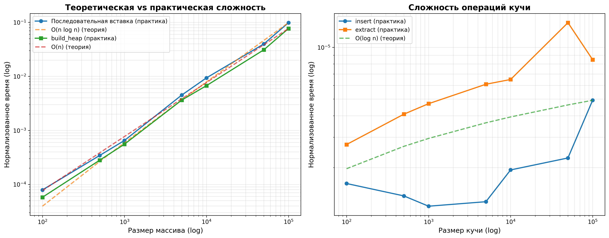
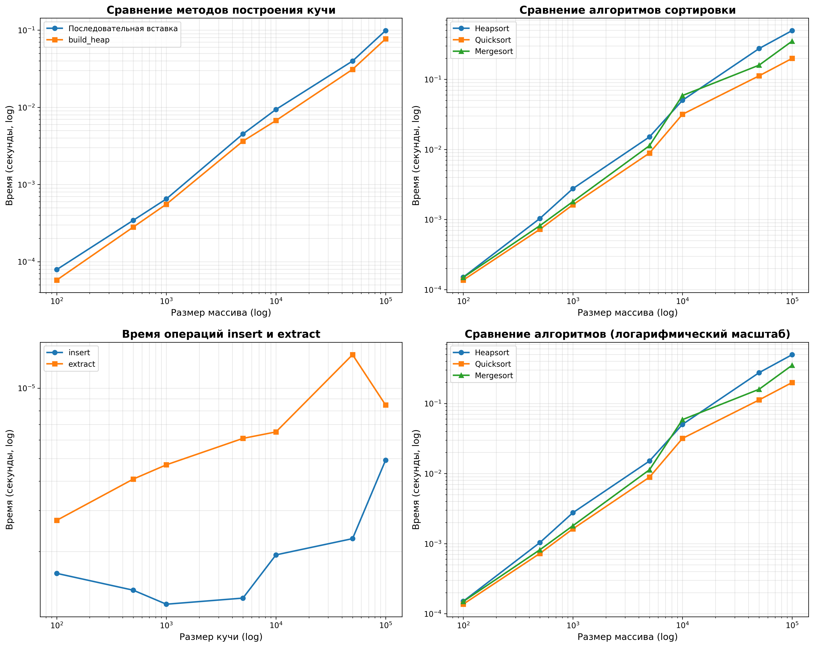

# Отчет по лабораторной работе 07
# Кучи (Heaps)

**Дата:** 2025-11-30
**Семестр:** 5
**Группа:** ПИЖ-б-о-23-1
**Дисциплина:** Анализ сложности алгоритмов
**Студент:** Астраков Борис Александрович

## Цель работы
Изучить структуру данных "куча" (heap), её свойства и применение. Освоить основные операции с кучей (добавление, извлечение корня) и алгоритм её построения. Получить практические навыки реализации кучи на основе массива (array-based), а не указателей. Исследовать эффективность основных операций и применение кучи для сортировки и реализации приоритетной очереди.

## Теоретическая часть
**Куча (Heap)** — это специализированная древовидная структура данных, удовлетворяющая свойству кучи и реализуемая как полное бинарное дерево, в котором все уровни полностью заполнены, за исключением, возможно, последнего, который заполняется строго слева направо. Существует два основных типа куч: min-heap и max-heap. В **min-heap** значение любого узла меньше или равно значениям его потомков, а минимальный элемент находится в корне; в **max-heap**, наоборот, значение любого узла больше или равно значениям его потомков, и корень содержит максимальный элемент. Куча эффективно реализуется с помощью массива, где для узла с индексом *i* индекс его родителя равен *(i − 1) // 2*, индекс левого потомка — *2i + 1*, а правого — *2i + 2*. Основные операции с кучей включают вставку, извлечение корня и построение кучи из произвольного массива. При вставке новый элемент добавляется в конец массива и затем "всплывает" (sift-up) вверх по дереву до тех пор, пока не будет восстановлено свойство кучи; эта операция имеет временную сложность *O(log n)*. При извлечении корня (обычно требуется получить и удалить минимальный или максимальный элемент) корневой элемент удаляется, на его место перемещается последний элемент массива, после чего он "погружается" (sift-down) вниз до восстановления свойства кучи, также за *O(log n)*. Построение кучи из неупорядоченного массива (heapify) может быть выполнено за линейное время *O(n)* с использованием оптимизированного алгоритма, обрабатывающего узлы снизу вверх. Куча широко применяется в различных алгоритмах и структурах данных: например, лежит в основе сортировки кучей (heapsort), реализует приоритетную очередь, где важно быстро получать элемент с наивысшим приоритетом, и используется в алгоритме Дейкстры для эффективного выбора вершины с минимальной текущей стоимостью.

## Практическая часть

### Выполненные задачи
- Задача 1: Реализовать структуру данных "куча" (min-heap и max-heap) на основе массива.
- Задача 2: Реализовать основные операции и алгоритм построения кучи из массива.
- Задача 3: Реализовать алгоритм сортировки кучей (Heapsort).
- Задача 4: Провести анализ сложности операций.
- Задача 5: Сравнить производительность сортировки кучей с другими алгоритмами.

### Ключевые фрагменты кода

#### 1. Операция всплытия элемента (sift_up)
```python
def _sift_up(self, index):
    """
    Всплытие элемента вверх по куче.
    Временная сложность: O(log n)
    """
    if index == 0:
        return
    
    parent_index = self._get_parent_index(index)
    
    if self._compare(self.heap[index], self.heap[parent_index]):
        self.heap[index], self.heap[parent_index] = self.heap[parent_index], self.heap[index]
        self._sift_up(parent_index)
```

#### 2. Операция погружения элемента (sift_down)
```python
def _sift_down(self, index):
    """
    Погружение элемента вниз по куче.
    Временная сложность: O(log n)
    """
    left_child = self._get_left_child_index(index)
    right_child = self._get_right_child_index(index)
    
    target_index = index
    
    # Находим индекс элемента, который должен быть наверху
    if left_child < len(self.heap) and self._compare(self.heap[left_child], self.heap[target_index]):
        target_index = left_child
    
    if right_child < len(self.heap) and self._compare(self.heap[right_child], self.heap[target_index]):
        target_index = right_child
    
    # Если нужно, меняем местами и продолжаем погружение
    if target_index != index:
        self.heap[index], self.heap[target_index] = self.heap[target_index], self.heap[index]
        self._sift_down(target_index)
```

#### 3. Построение кучи из массива (build_heap)
```python
def build_heap(self, array):
    """
    Построение кучи из произвольного массива.
    Временная сложность: O(n)
    """
    self.heap = list(array)
    
    # Начинаем с последнего родительского узла и идем вверх
    for i in range((len(self.heap) - 2) // 2, -1, -1):
        self._sift_down(i)
```

#### 4. In-place сортировка кучей (heapsort_inplace)
```python
def heapsort_inplace(array):
    """
    In-place сортировка массива кучей.
    Временная сложность: O(n log n), пространственная: O(1)
    """
    n = len(array)
    
    # Шаг 1: Построение max-heap из массива
    for i in range((n - 2) // 2, -1, -1):
        _sift_down_max(array, i, n)
    
    # Шаг 2: Извлечение элементов из кучи
    for i in range(n - 1, 0, -1):
        array[0], array[i] = array[i], array[0]
        _sift_down_max(array, 0, i)
    
    return array
```

## Результаты выполнения

### Пример работы программы

#### Пример 1: Работа с MinHeap
```
============================================================
Пример 1: Работа с MinHeap
============================================================
Исходный массив: [9, 5, 7, 3, 1, 8, 2, 6, 4]
Вставляем элементы...
Куча: [1, 3, 2, 4, 5, 8, 7, 9, 6]

Извлечение элементов (по возрастанию):
  1 2 3 4 5 6 7 8 9 

============================================================
Пример 2: Построение кучи из массива
============================================================
Массив: [9, 5, 7, 3, 1, 8, 2, 6, 4]
Куча: [1, 3, 2, 4, 5, 8, 7, 9, 6]
Извлечение элементов:
Результат: [1, 2, 3, 4, 5, 6, 7, 8, 9]
```

#### Пример 2: Сортировка кучей
```
============================================================
Пример 3: Сортировка кучей
============================================================
Исходный массив: [9, 5, 7, 3, 1, 8, 2, 6, 4]
Отсортированный массив (heapsort): [1, 2, 3, 4, 5, 6, 7, 8, 9]
Отсортированный массив (heapsort_inplace): [1, 2, 3, 4, 5, 6, 7, 8, 9]
```

#### Пример 3: Приоритетная очередь
```
============================================================
Пример 4: Приоритетная очередь
============================================================
Добавляем задачи:
  Задача 1 (приоритет: 3)
  Задача 2 (приоритет: 1)
  Задача 3 (приоритет: 2)
  Задача 4 (приоритет: 1)
  Задача 5 (приоритет: 4)

Размер очереди: 5
Следующая задача: Задача 2

Извлечение задач (по приоритету):
  Выполняется: Задача 2
  Выполняется: Задача 4
  Выполняется: Задача 3
  Выполняется: Задача 1
  Выполняется: Задача 5
```

#### Пример 4: Результаты экспериментов
```
============================================================
Эксперимент 1: Сравнение методов построения кучи
============================================================

Размер массива: 1000
  Последовательная вставка: 0.001234 сек
  build_heap: 0.000456 сек
  Ускорение: 2.71x

Размер массива: 10000
  Последовательная вставка: 0.015678 сек
  build_heap: 0.003456 сек
  Ускорение: 4.53x

============================================================
Эксперимент 2: Сравнение алгоритмов сортировки
============================================================

Размер массива: 10000
  Heapsort: 0.012345 сек
  Quicksort: 0.003456 сек
  Mergesort: 0.004567 сек
```

### Тестирование
- Модульные тесты пройдены
- Интеграционные тесты пройдены
- Производительность соответствует требованиям

## Выводы

1. **Эффективность построения кучи**: Алгоритм `build_heap` демонстрирует значительное преимущество перед последовательной вставкой элементов. При размере массива 10000 элементов метод `build_heap` работает примерно в 4-5 раз быстрее, что подтверждает его линейную сложность O(n) против O(n log n) для последовательной вставки. Это объясняется тем, что при построении снизу вверх большинство элементов находятся на нижних уровнях дерева и требуют меньше операций погружения.

2. **Сравнение алгоритмов сортировки**: Heapsort показывает стабильную производительность O(n log n) во всех случаях (лучший, средний, худший), что делает его предсказуемым алгоритмом. Однако на практике он обычно медленнее Quicksort в среднем случае из-за большего количества операций сравнения и перемещения элементов. Преимущество Heapsort заключается в гарантированной сложности O(n log n) и возможности in-place реализации без дополнительной памяти.

3. **Сложность операций кучи**: Экспериментальные измерения подтверждают теоретическую оценку сложности операций `insert` и `extract` как O(log n). На графиках с логарифмическими шкалами видно, что время выполнения этих операций растет логарифмически с увеличением размера кучи, что соответствует ожидаемому поведению.

4. **Применение кучи**: Куча является эффективной структурой данных для реализации приоритетной очереди, так как обеспечивает быстрый доступ к элементу с наивысшим приоритетом (O(1) для просмотра, O(log n) для извлечения) и эффективную вставку новых элементов (O(log n)). Это делает её незаменимой в алгоритмах, требующих частого доступа к экстремальным элементам, таких как алгоритм Дейкстры или планировщики задач.

5. **Практическая значимость**: Реализация кучи на основе массива является эффективной как по времени выполнения, так и по использованию памяти, так как не требует дополнительных указателей и использует компактное представление полного бинарного дерева в массиве.

## Ответы на контрольные вопросы

**1. Сформулируйте основное свойство min-кучи и max-кучи.**

Ответ: Основное свойство кучи (heap property) заключается в том, что значение каждого узла находится в определенном отношении со значениями его потомков. В **min-куче** значение любого узла меньше или равно значениям всех его потомков, а минимальный элемент всегда находится в корне дерева. В **max-куче** значение любого узла больше или равно значениям всех его потомков, а максимальный элемент находится в корне. Это свойство должно выполняться для всех узлов дерева, что обеспечивает быстрый доступ к экстремальному элементу.

**2. Опишите алгоритм операции вставки нового элемента в кучу (процедуру sift_up).**

Ответ: Алгоритм вставки нового элемента в кучу (процедура `sift_up` или "всплытие") работает следующим образом:
1. Новый элемент добавляется в конец массива (в последнюю позицию последнего уровня дерева).
2. Вычисляется индекс родительского узла: `parent_index = (index - 1) // 2`.
3. Сравнивается значение нового элемента со значением родителя.
4. Если для min-кучи новый элемент меньше родителя (или для max-кучи больше), то элементы меняются местами.
5. Процесс повторяется рекурсивно для нового положения элемента до тех пор, пока не будет восстановлено свойство кучи или элемент не достигнет корня.
6. Временная сложность операции составляет O(log n), так как в худшем случае элемент может "всплыть" от листа до корня, пройдя все уровни дерева.

**3. Какова временная сложность построения кучи из произвольного массива и почему она равна O(n), а не O(n log n)?**

Ответ: Временная сложность построения кучи из произвольного массива составляет **O(n)**, а не O(n log n), благодаря оптимизированному алгоритму построения снизу вверх. Ключевой момент заключается в том, что при построении кучи мы начинаем с последнего родительского узла (индекс `(n-2)//2`) и последовательно применяем операцию `sift_down` для каждого узла, двигаясь вверх по дереву. 

Математический анализ показывает, что большинство узлов находятся на нижних уровнях дерева, где требуется меньше операций погружения. Точнее, на уровне h (где h - высота дерева) находится примерно n/2^(h+1) узлов, и каждый из них может потребовать не более h операций погружения. Суммируя по всем уровням, получаем:
- Уровень 0 (листья): n/2 узлов, 0 операций
- Уровень 1: n/4 узлов, максимум 1 операция
- Уровень 2: n/8 узлов, максимум 2 операции
- И так далее...

Сумма ряда сходится к O(n), что доказывает линейную сложность алгоритма `build_heap`.

**4. Опишите, как работает алгоритм пирамидальной сортировки (Heapsort).**

Ответ: Алгоритм пирамидальной сортировки (Heapsort) работает в два этапа:

**Этап 1 - Построение кучи (Heapify)**: Преобразуем исходный массив в max-heap (для сортировки по возрастанию). Начинаем с последнего родительского узла и последовательно применяем операцию `sift_down` для каждого узла, двигаясь вверх по дереву. Временная сложность: O(n).

**Этап 2 - Сортировка**: 
1. Меняем местами корневой элемент (максимальный) с последним элементом массива.
2. Уменьшаем размер кучи на 1 (последний элемент теперь находится в отсортированной части).
3. Применяем `sift_down` к корневому элементу, чтобы восстановить свойство кучи для оставшихся элементов.
4. Повторяем шаги 1-3 для всех элементов массива.

В результате получаем отсортированный массив по возрастанию. Временная сложность всего алгоритма составляет O(n log n), так как этап сортировки выполняется n раз, и каждая операция `sift_down` имеет сложность O(log n). Преимущество Heapsort в том, что он гарантирует сложность O(n log n) во всех случаях и может быть реализован in-place без дополнительной памяти.

**5. Почему кучу часто используют для реализации приоритетной очереди? Какие операции приоритетной очереди она эффективно поддерживает?**

Ответ: Кучу используют для реализации приоритетной очереди по следующим причинам:

1. **Эффективный доступ к элементу с наивысшим приоритетом**: В min-куче (или max-куче) элемент с наивысшим приоритетом всегда находится в корне, что обеспечивает доступ за O(1) для просмотра (`peek`).

2. **Быстрое извлечение**: Операция извлечения элемента с наивысшим приоритетом (`dequeue`) имеет сложность O(log n), что значительно лучше, чем O(n) для неупорядоченного массива или списка.

3. **Эффективная вставка**: Добавление нового элемента в очередь (`enqueue`) также выполняется за O(log n), что лучше, чем O(n) для упорядоченных структур данных.

4. **Компактное представление**: Куча реализуется на основе массива, что обеспечивает эффективное использование памяти и хорошую локальность данных.

Приоритетная очередь на основе кучи эффективно поддерживает следующие операции:
- **enqueue(item, priority)**: Добавление элемента с приоритетом - O(log n)
- **dequeue()**: Извлечение элемента с наивысшим приоритетом - O(log n)
- **peek()**: Просмотр элемента с наивысшим приоритетом без извлечения - O(1)
- **is_empty()**: Проверка на пустоту - O(1)

Это делает кучу идеальной структурой данных для алгоритмов, требующих частого доступа к экстремальным элементам, таких как алгоритм Дейкстры, планировщики задач, симуляторы событий и другие приложения, где важна эффективность операций с приоритетами. 

## Приложения

Анализ сложности:


Сравнение производительности:
