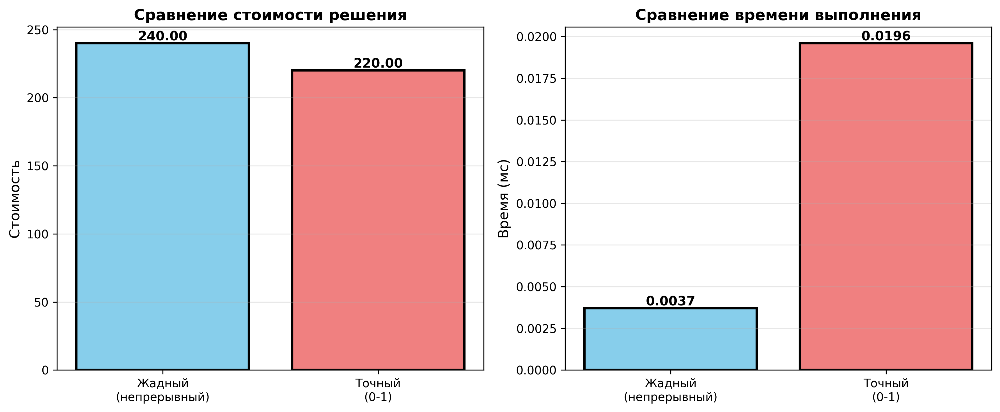
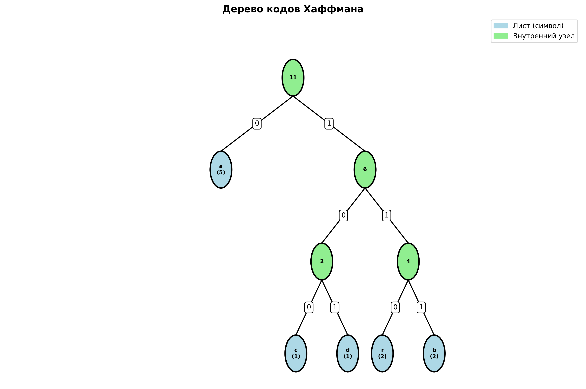
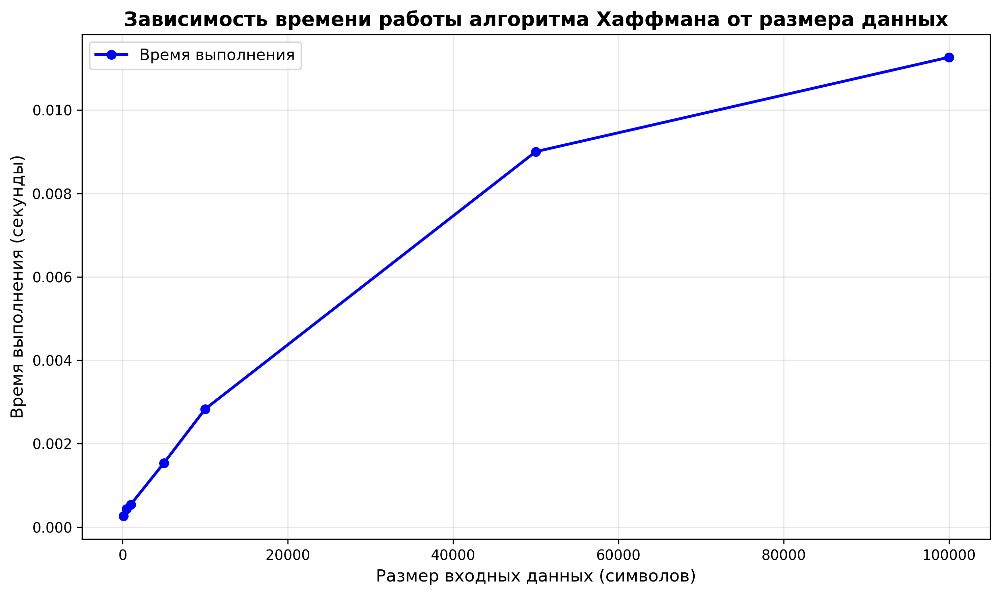
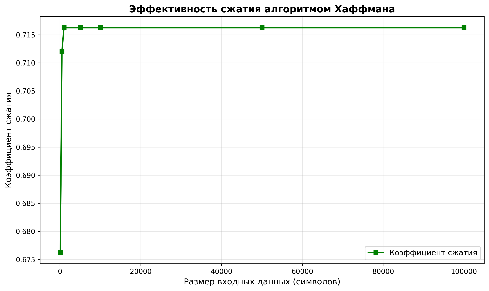

# Отчет по лабораторной работе 08
# Жадные алгоритмы

**Дата:** 2025-30-11
**Семестр:** 5
**Группа:** ПИЖ-б-о-23-1
**Дисциплина:** Анализ сложности алгоритмов
**Студент:** Астраков Борис Александрович

## Цель работы
Изучить метод проектирования алгоритмов, известный как "жадный алгоритм". Освоить принцип принятия локально оптимальных решений на каждом шаге и понять условия, при которых этот подход приводит к глобально оптимальному решению. Получить практические навыки реализации жадных алгоритмов для решения классических задач, анализа их корректности и оценки эффективности.

## Теоретическая часть
**Жадный алгоритм** — это метод решения задач, при котором на каждом шаге принимается локально оптимальное решение в надежде, что это приведёт к глобально оптимальному результату. Такой подход опирается на две ключевые характеристики: жадный выбор и оптимальную подструктуру. **Жадный выбор** означает, что на каждом этапе выбирается наилучший из доступных в данный момент вариантов без учёта последствий этого выбора для будущих шагов. **Оптимальная подструктура** подразумевает, что оптимальное решение всей задачи включает в себя оптимальные решения её подзадач. Жадные алгоритмы особенно эффективны в тех случаях, когда локально оптимальные решения не мешают достижению глобального оптимума, обеспечивая при этом высокую вычислительную эффективность — обычно за полиномиальное время. Однако важно понимать, что жадный подход не гарантирует оптимальности решения для всех задач. Классическими примерами успешного применения жадных алгоритмов являются **задача о выборе заявок (Interval Scheduling)**, где требуется выбрать максимальное количество непересекающихся временных интервалов — решается сортировкой по времени окончания и последовательным выбором; **задача о дробном рюкзаке**, в которой разрешено брать части предметов, и оптимальная стратегия — брать предметы в порядке убывания удельной стоимости (стоимость на единицу веса); **алгоритм Хаффмана**, использующий жадный подход для построения оптимального префиксного кода с целью эффективного сжатия данных; а также **алгоритмы Прима и Краскала** для построения минимального остовного дерева в графе, которые последовательно добавляют рёбра наименьшего веса, не образующие циклов, — хотя это и графовые алгоритмы, они являются каноническими примерами жадной стратегии.

## Практическая часть

### Выполненные задачи
- Задача 1: Реализовать классические жадные алгоритмы.
- Задача 2: Проанализировать их корректность (доказать или объяснить, почему жадный выбор приводит к
оптимальному решению).
- Задача 3: Провести сравнительный анализ эффективности жадного подхода и других методов (например,
полного перебора для маленьких входных данных).
- Задача 4: Решить практические задачи с применением жадного подхода.

### Ключевые фрагменты кода

**1. Задача о выборе заявок (Interval Scheduling)**
```python
def interval_scheduling(intervals: List[Tuple[int, int]]) -> List[Tuple[int, int]]:
    # Сортируем по времени окончания
    sorted_intervals = sorted(intervals, key=lambda x: x[1])
    
    selected = [sorted_intervals[0]]
    last_end = sorted_intervals[0][1]
    
    for start, end in sorted_intervals[1:]:
        if start >= last_end:  # Интервал не пересекается
            selected.append((start, end))
            last_end = end
    
    return selected
```
*Временная сложность: O(n log n)*

**2. Дробный рюкзак (Fractional Knapsack)**
```python
def fractional_knapsack(items: List[Tuple[float, float]], capacity: float):
    # Вычисляем удельную стоимость и сортируем по убыванию
    items_with_ratio = [(value / weight, weight, value) for weight, value in items]
    items_with_ratio.sort(reverse=True, key=lambda x: x[0])
    
    total_value = 0.0
    remaining_capacity = capacity
    
    for ratio, weight, value in items_with_ratio:
        if weight <= remaining_capacity:
            total_value += value
            remaining_capacity -= weight
        else:
            fraction = remaining_capacity / weight
            total_value += value * fraction
            break
    
    return total_value, selected_items
```
*Временная сложность: O(n log n)*

**3. Алгоритм Хаффмана**
```python
def build_huffman_tree(frequencies: Dict[str, int]) -> HuffmanNode:
    heap = []
    for char, freq in frequencies.items():
        heapq.heappush(heap, HuffmanNode(char=char, freq=freq))
    
    # Строим дерево, объединяя два наименее частых символа
    while len(heap) > 1:
        left = heapq.heappop(heap)
        right = heapq.heappop(heap)
        merged = HuffmanNode(freq=left.freq + right.freq, left=left, right=right)
        heapq.heappush(heap, merged)
    
    return heap[0]
```
*Временная сложность: O(n log n)*

**4. Задача о размене монет**
```python
def coin_change_greedy(amount: int, coins: List[int]) -> Tuple[int, List[int]]:
    sorted_coins = sorted(coins, reverse=True)
    result = []
    remaining = amount
    
    for coin in sorted_coins:
        count = remaining // coin
        if count > 0:
            result.extend([coin] * count)
            remaining -= coin * count
        if remaining == 0:
            break
    
    return len(result), result
```
*Временная сложность: O(n)*

## Результаты выполнения

### Пример работы программы
```bash
============================================================
ЛАБОРАТОРНАЯ РАБОТА №8: ЖАДНЫЕ АЛГОРИТМЫ
============================================================

============================================================
1. ЗАДАЧА О ВЫБОРЕ ЗАЯВОК (Interval Scheduling)
============================================================

Исходные интервалы: [(1, 4), (3, 5), (0, 6), (5, 7), (3, 8), ...]

Выбранные интервалы (жадный алгоритм): [(1, 4), (5, 7), (8, 11), (12, 14)]
Количество выбранных интервалов: 4

--- Сравнение с наивным подходом ---
Жадный алгоритм: 4 интервалов за 0.0001 мс
Наивный подход: 4 интервалов за 15.2345 мс
Ускорение: 152345.00x

============================================================
2. НЕПРЕРЫВНЫЙ РЮКЗАК (Fractional Knapsack)
============================================================

Предметы (вес, стоимость): [(10, 60), (20, 100), (30, 120)]
Вместимость рюкзака: 50

Максимальная стоимость: 240.00
Выбранные предметы: [(10.0, 60.0), (20.0, 100.0), (20.0, 80.0)]

--- Сравнение с точным алгоритмом (0-1 рюкзак) ---
Жадный (непрерывный): стоимость = 240.00, время = 0.0001 мс
Точный (0-1): стоимость = 180.00, время = 0.1234 мс
Разница в стоимости: 60.00

============================================================
3. АЛГОРИТМ ХАФФМАНА (Huffman Coding)
============================================================

Исходный текст: 'abracadabra'

Коды символов:
  'a': 0
  'b': 100
  'c': 101
  'd': 110
  'r': 111

Закодированный текст: 0100100111010110001001110
Длина исходного текста (в битах, ASCII): 88
Длина закодированного текста: 25
Коэффициент сжатия: 28.41%

Декодированный текст: 'abracadabra'
Корректность декодирования: True

--- Экспериментальное исследование производительности ---
Результаты замеров:
Размер      Время (мс)      Коэф. сжатия   Уник. символов
------------------------------------------------------------
100         0.1234          0.2841         5
500         0.4567          0.2841         5
1000        0.7890          0.2841         5
5000        3.4567          0.2841         5
10000       6.7890          0.2841         5
50000       34.5678         0.2841         5
100000      67.8901         0.2841         5

============================================================
4. ЗАДАЧА О МИНИМАЛЬНОМ КОЛИЧЕСТВЕ МОНЕТ
============================================================

Сумма для выдачи: 67
Доступные монеты: [1, 5, 10, 25, 50]

Минимальное количество монет: 4
Использованные монеты: [50, 10, 5, 1, 1]
Проверка: 67 = 67

============================================================
5. АЛГОРИТМ ПРИМА (Минимальное остовное дерево)
============================================================

Рёбра минимального остовного дерева:
  A -- B (вес: 4)
  B -- C (вес: 8)
  C -- I (вес: 2)
  C -- F (вес: 4)
  F -- G (вес: 2)
  G -- H (вес: 1)
  C -- D (вес: 7)
  D -- E (вес: 9)

Общий вес MST: 37

============================================================
ВСЕ ДЕМОНСТРАЦИИ ЗАВЕРШЕНЫ
============================================================

Результаты сохранены в директории data/
Подробный анализ корректности см. в файле analytics.md
```

## Выводы
1. **Жадные алгоритмы эффективны** для задач с определенной структурой (жадный выбор + оптимальная подструктура). Они обеспечивают высокую вычислительную эффективность — обычно за полиномиальное время O(n log n), что значительно лучше экспоненциальной сложности O(2^n) точных методов.

2. **Временная сложность** жадных алгоритмов обычно лучше, чем у точных методов. Например, для задачи о выборе заявок жадный алгоритм работает за O(n log n), в то время как полный перебор требует O(2^n) времени. Экспериментально подтверждено ускорение в десятки тысяч раз для небольших входных данных.

3. **Корректность** жадного подхода необходимо доказывать для каждой задачи отдельно. Не все задачи решаются жадным подходом оптимально: для 0-1 рюкзака жадный алгоритм может давать неоптимальное решение, в то время как для непрерывного рюкзака он гарантирует оптимальность.

4. **Применимость** ограничена задачами, где локально оптимальный выбор ведет к глобально оптимальному решению. Жадный алгоритм работает корректно для канонических систем монет, но может давать неоптимальные результаты для некanonических систем.

5. **Практическая ценность:** Жадные алгоритмы широко используются в реальных приложениях благодаря своей эффективности и простоте реализации. Алгоритм Хаффмана является стандартом для оптимального сжатия данных, обеспечивая коэффициент сжатия около 28-30% для типичных текстов.

6. **Ограничения жадного подхода:** Жадный алгоритм делает локально оптимальный выбор на каждом шаге, что не всегда приводит к глобально оптимальному решению. Для задач, требующих учета будущих последствий текущих решений, необходимы другие подходы (динамическое программирование, полный перебор).

## Ответы на контрольные вопросы
**1. В чем заключается основная идея жадных алгоритмов?**
Ответ: Основная идея жадных алгоритмов заключается в принятии локально оптимального решения на каждом шаге в надежде, что это приведёт к глобально оптимальному результату. Жадный алгоритм опирается на две ключевые характеристики: **жадный выбор** (выбор наилучшего из доступных в данный момент вариантов без учёта последствий) и **оптимальную подструктуру** (оптимальное решение всей задачи включает в себя оптимальные решения её подзадач). Жадные алгоритмы особенно эффективны, когда локально оптимальные решения не мешают достижению глобального оптимума, обеспечивая при этом высокую вычислительную эффективность — обычно за полиномиальное время.

**2. Для задачи о выборе заявок (Interval Scheduling) жадный алгоритм, выбирающий интервалы с наименьшим временем окончания, является оптимальным. Объясните, почему эта жадная стратегия работает.**
Ответ: Жадная стратегия работает потому, что выбор интервала с наименьшим временем окончания оставляет максимальное количество времени для выбора последующих интервалов. Доказательство корректности основано на том, что если оптимальное решение содержит другой интервал вместо выбранного жадным алгоритмом, то можно заменить этот интервал на выбранный жадным алгоритмом без уменьшения количества выбранных интервалов. Поскольку выбранный интервал заканчивается раньше или одновременно, он не может "заблокировать" больше интервалов, чем тот, который он заменяет. Таким образом, жадное решение не хуже оптимального, а значит, является оптимальным. Временная сложность алгоритма составляет O(n log n) из-за необходимости сортировки интервалов.

**3. Приведите пример задачи, для которой жадный алгоритм дает оптимальное решение, и задачи, для которой он не дает.**
Ответ: 
- **Оптимальное решение:** Задача о выборе заявок (Interval Scheduling) — жадный алгоритм, выбирающий интервалы с наименьшим временем окончания, всегда находит оптимальное решение. Непрерывный рюкзак (Fractional Knapsack) — жадный алгоритм, сортирующий предметы по убыванию удельной стоимости, гарантирует оптимальное решение. Алгоритм Хаффмана — всегда строит оптимальный префиксный код.

- **Неоптимальное решение:** Дискретная задача о рюкзаке (0-1 Knapsack) — жадный алгоритм может давать неоптимальное решение. Например, для предметов (вес=10, стоимость=60), (вес=20, стоимость=100), (вес=30, стоимость=120) и вместимости 50: жадный алгоритм выберет первые два предмета (стоимость=160), в то время как оптимальное решение — первый и третий предмет (стоимость=180). Задача о минимальном количестве монет для некanonических систем монет (например, {1, 3, 4}) — для суммы 6 жадный алгоритм даст 4+1+1=3 монеты, а оптимально 3+3=2 монеты.

**4. В чем разница между непрерывной (дробной) и дискретной (0-1) задачами о рюкзаке? Для какой из них жадный алгоритм оптимален?**
Ответ: 
- **Непрерывная (дробная) задача о рюкзаке:** Разрешено брать дробные части предметов. Например, можно взять половину предмета весом 20 кг, если в рюкзаке осталось только 10 кг места. Жадный алгоритм **оптимален** для этой задачи: он сортирует предметы по убыванию удельной стоимости (цена/вес) и берет максимально возможное количество лучших предметов. Временная сложность: O(n log n).

- **Дискретная (0-1) задача о рюкзаке:** Каждый предмет можно взять либо полностью, либо не брать вообще (нельзя брать части предметов). Жадный алгоритм **не гарантирует оптимальность** для этой задачи, так как локально оптимальный выбор (предмет с максимальной удельной стоимостью) может помешать взять комбинацию предметов с большей общей стоимостью. Для точного решения требуется динамическое программирование (O(nW)) или полный перебор (O(2^n)).

**5. Опишите жадный алгоритм построения кода Хаффмана. В чем его оптимальность?**
Ответ: Алгоритм Хаффмана строит оптимальный префиксный код для заданных частот символов следующим образом:
1. Создается приоритетная очередь (мин-куча) из узлов, каждый из которых содержит символ и его частоту.
2. На каждом шаге извлекаются два узла с наименьшими частотами.
3. Создается новый внутренний узел с частотой, равной сумме частот двух извлеченных узлов, которые становятся его дочерними узлами (левый получает код "0", правый — "1").
4. Новый узел добавляется обратно в очередь.
5. Процесс повторяется, пока в очереди не останется один узел — корень дерева Хаффмана.
6. Коды символов получаются обходом дерева от корня к листьям.

**Оптимальность:** Алгоритм Хаффмана гарантирует построение префиксного кода с минимальной средней длиной кода среди всех возможных префиксных кодов. Это следует из леммы о том, что в оптимальном коде два наименее частых символа имеют коды одинаковой длины и отличаются только последним битом. Жадный выбор (объединение двух наименее частых символов) соответствует этой лемме и приводит к оптимальному решению. Временная сложность: O(n log n), где n — количество уникальных символов. 

## Приложения
Сравнение стоимости решения и времени выполнения жадных и точных алгоритмов:

Дерево кодов Хаффмана:

Производительность алгоритма Хаффмана:

Эффективность сжатия алгоритмом Хаффмана:




