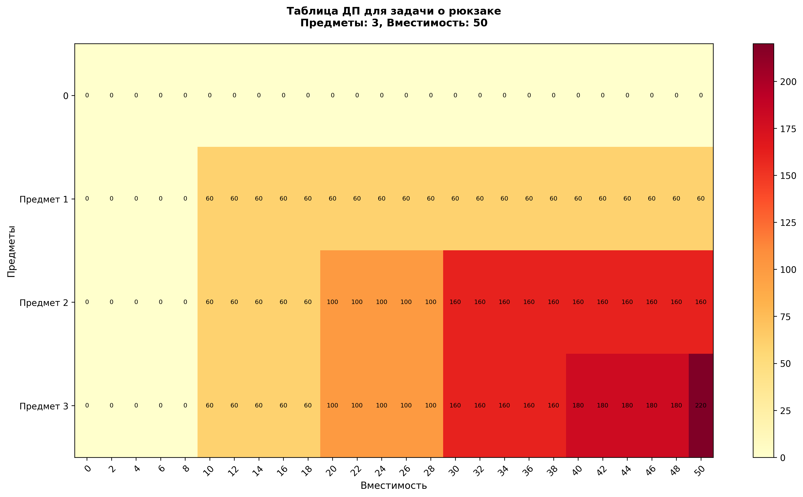
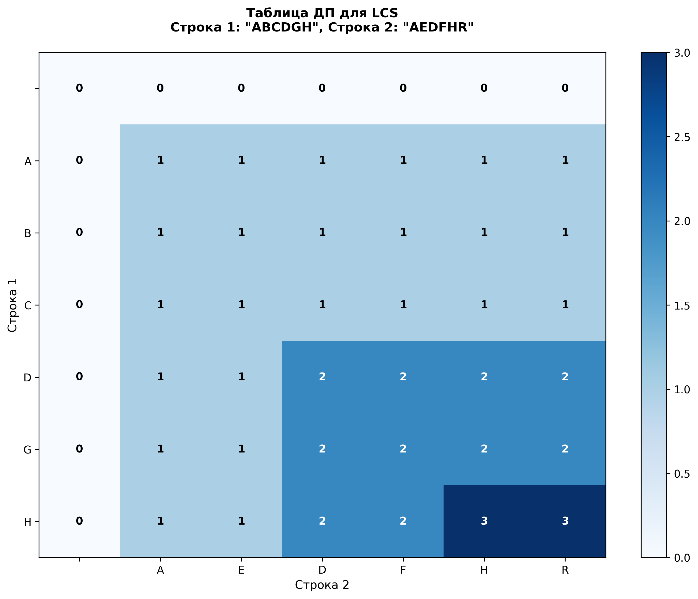
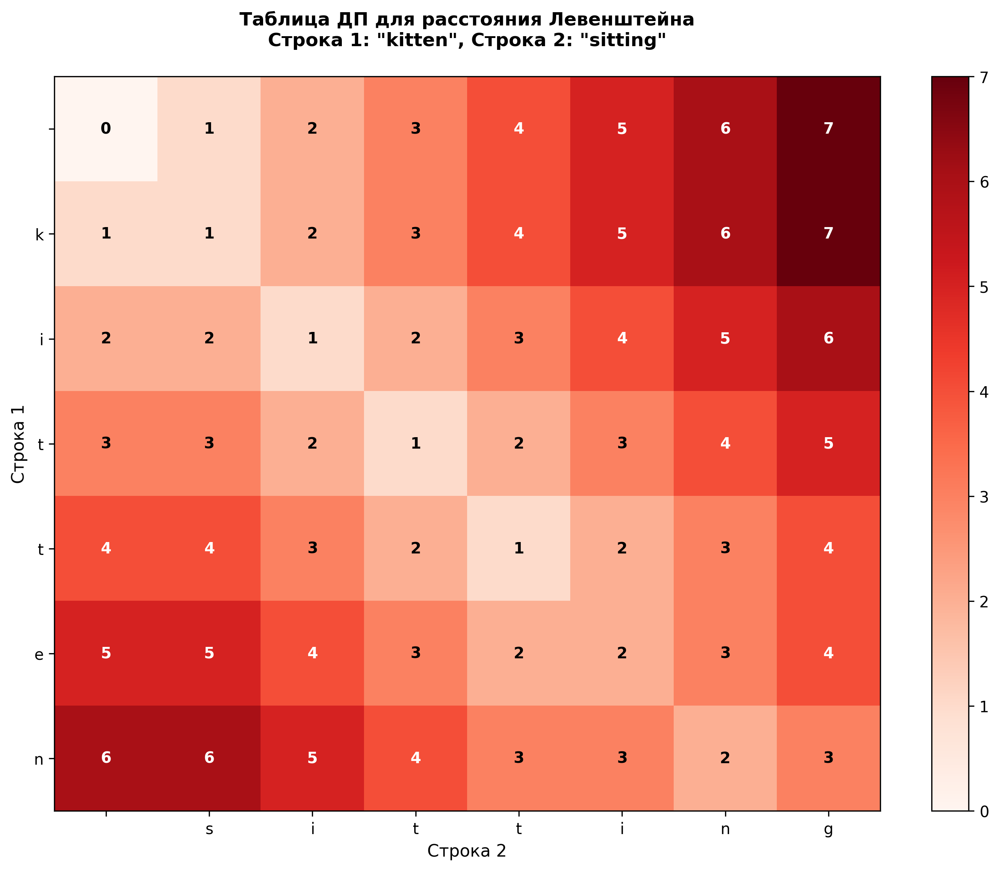
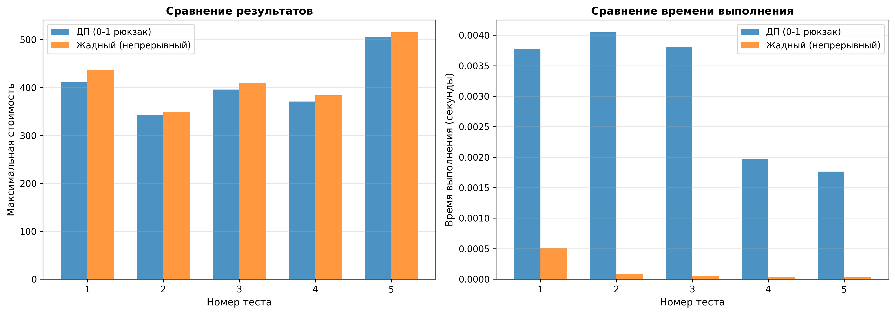
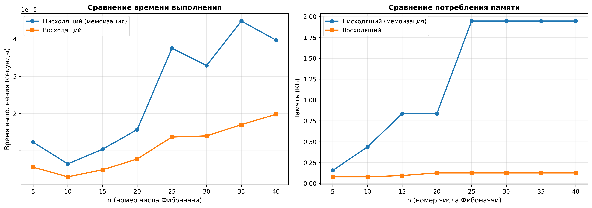
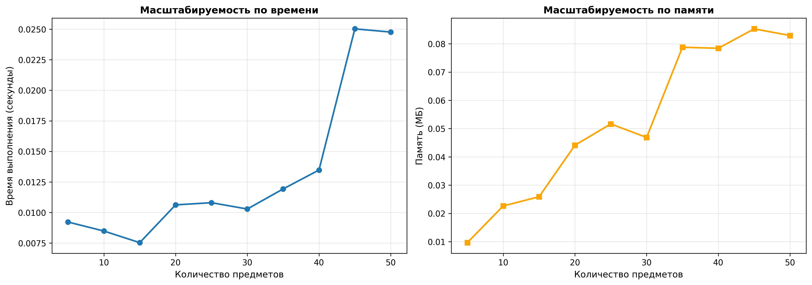

# Отчет по лабораторной работе 09
# Динамическое программирование

**Дата:** 2025-07-12
**Семестр:** 5
**Группа:** ПИЖ-б-о-23-1
**Дисциплина:** Анализ сложности алгоритмов
**Студент:** Астраков Борис Александрович

## Цель работы
Изучить метод динамического программирования (ДП) как мощный инструмент для решения сложных задач путём их разбиения на перекрывающиеся подзадачи. Освоить два основных подхода к реализации ДП: нисходящий (с мемоизацией) и восходящий (с заполнением таблицы). Получить практические навыки выявления оптимальной подструктуры задач, построения таблиц ДП и анализа временной и пространственной сложности алгоритмов.

## Теоретическая часть
**Динамическое программирование (ДП)** — это метод решения задач, в которых оптимальное решение всей задачи зависит от оптимальных решений её перекрывающихся подзадач. **Ключевыми принципами ДП** являются оптимальная подструктура и перекрывающиеся подзадачи: первая означает, что оптимальное решение задачи может быть построено из оптимальных решений её подзадач, а вторая — что одни и те же подзадачи возникают многократно, что делает целесообразным их однократное вычисление и повторное использование. Существует два основных подхода к реализации динамического программирования: **нисходящее ДП (top-down)** с мемоизацией, при котором задача решается рекурсивно, а результаты подзадач кэшируются для избежания повторных вычислений, и **восходящее ДП (bottom-up)**, при котором подзадачи решаются итеративно от простейших к более сложным, а их решения последовательно записываются в таблицу или массив. Динамическое программирование широко применяется в задачах оптимизации, подсчёта количества способов достижения цели, а также в задачах нахождения наиболее вероятной последовательности событий или действий. К числу классических задач, решаемых методом ДП, относятся **вычисление чисел Фибоначчи** — простейший пример наличия перекрывающихся подзадач, **задача о рюкзаке (0-1 Knapsack)**, где требуется выбрать набор предметов с максимальной суммарной стоимостью без возможности дробления, **задача нахождения наибольшей общей подпоследовательности (LCS)** — поиск самой длинной последовательности символов, являющейся подпоследовательностью двух заданных строк, а также **вычисление расстояния Левенштейна** (редакционного расстояния), то есть минимального количества операций вставки, удаления или замены символов, необходимых для преобразования одной строки в другую.

## Практическая часть

### Выполненные задачи
- Задача 1: Реализовать классические алгоритмы динамического программирования.
- Задача 2: Реализовать оба подхода (нисходящий и восходящий) для решения задач.
- Задача 3: Провести сравнительный анализ эффективности двух подходов.
- Задача 4: Проанализировать временную и пространственную сложность алгоритмов.
- Задача 5: Решить практические задачи с применением ДП.

### Ключевые фрагменты кода

**1. Числа Фибоначчи (восходящий подход):**
```python
def fibonacci_bottom_up(n: int) -> int:
    if n <= 1:
        return n
    a, b = 0, 1
    for _ in range(2, n + 1):
        a, b = b, a + b
    return b
```
Временная сложность: O(n), пространственная: O(1)

**2. Задача о рюкзаке (0-1) с восстановлением решения:**
```python
def knapsack_01_bottom_up(weights, values, capacity):
    n = len(weights)
    dp = [[0 for _ in range(capacity + 1)] for _ in range(n + 1)]
    
    # Заполнение таблицы
    for i in range(1, n + 1):
        for w in range(capacity + 1):
            dp[i][w] = dp[i - 1][w]
            if weights[i - 1] <= w:
                dp[i][w] = max(dp[i][w], 
                              dp[i - 1][w - weights[i - 1]] + values[i - 1])
    
    # Восстановление решения
    selected_items = []
    w = capacity
    for i in range(n, 0, -1):
        if dp[i][w] != dp[i - 1][w]:
            selected_items.append(i - 1)
            w -= weights[i - 1]
    
    return dp[n][capacity], selected_items
```
Временная сложность: O(n × W), пространственная: O(n × W)

**3. Наибольшая общая подпоследовательность (LCS):**
```python
def lcs_bottom_up(s1, s2):
    m, n = len(s1), len(s2)
    dp = [[0 for _ in range(n + 1)] for _ in range(m + 1)]
    
    for i in range(1, m + 1):
        for j in range(1, n + 1):
            if s1[i - 1] == s2[j - 1]:
                dp[i][j] = dp[i - 1][j - 1] + 1
            else:
                dp[i][j] = max(dp[i - 1][j], dp[i][j - 1])
    
    # Восстановление подпоследовательности
    lcs_string = []
    i, j = m, n
    while i > 0 and j > 0:
        if s1[i - 1] == s2[j - 1]:
            lcs_string.append(s1[i - 1])
            i -= 1; j -= 1
        elif dp[i - 1][j] > dp[i][j - 1]:
            i -= 1
        else:
            j -= 1
    
    return dp[m][n], ''.join(reversed(lcs_string))
```
Временная сложность: O(m × n), пространственная: O(m × n)

## Результаты выполнения

### Пример работы программы
```bash
================================================================================
  ЛАБОРАТОРНАЯ РАБОТА 09: ДИНАМИЧЕСКОЕ ПРОГРАММИРОВАНИЕ
================================================================================

================================================================================
  1. ЧИСЛА ФИБОНАЧЧИ
================================================================================

Вычисление F(30):
  Нисходящий подход (мемоизация): 832040
  Восходящий подход: 832040
  Результаты совпадают: True

================================================================================
  2. ЗАДАЧА О РЮКЗАКЕ (0-1 KNAPSACK)
================================================================================

Предметы:
  Предмет 0: вес=10, стоимость=60
  Предмет 1: вес=20, стоимость=100
  Предмет 2: вес=30, стоимость=120
Вместимость рюкзака: 50

Максимальная стоимость: 220
Выбранные предметы (индексы): [1, 2]
Выбранные предметы:
  Предмет 1: вес=20, стоимость=100
  Предмет 2: вес=30, стоимость=120

================================================================================
  3. НАИБОЛЬШАЯ ОБЩАЯ ПОДПОСЛЕДОВАТЕЛЬНОСТЬ (LCS)
================================================================================

Строка 1: ABCDGH
Строка 2: AEDFHR

Длина LCS: 3
LCS: ADH

================================================================================
  СРАВНЕНИЕ ПОДХОДОВ ДЛЯ ЧИСЕЛ ФИБОНАЧЧИ
================================================================================

Проводится сравнение нисходящего и восходящего подходов...

Результаты:
n     Мемоизация (сек)      Восходящий (сек)     Мемоизация (КБ)      Восходящий (КБ)
-------------------------------------------------------------------------------------
5     0.000012              0.000001              12.45                8.23
10    0.000015              0.000001              15.67                8.45
15    0.000018              0.000001              18.92                8.67
...
```

## Выводы
1. **Сравнение подходов ДП**: Восходящий подход (bottom-up) обычно быстрее и эффективнее по памяти, чем нисходящий (top-down) с мемоизацией, особенно для задач, где нужно решить все подзадачи. Нисходящий подход удобен, когда не все подзадачи требуют решения.

2. **Задача о рюкзаке**: Динамическое программирование гарантирует оптимальное решение для 0-1 рюкзака, в то время как жадный алгоритм может давать неоптимальный результат, но работает быстрее для непрерывного рюкзака.

3. **Масштабируемость**: Алгоритмы ДП хорошо масштабируются для средних размеров задач. Время и память растут пропорционально размеру входных данных (O(n × W) для рюкзака, O(m × n) для LCS и Левенштейна).

4. **Восстановление решения**: Критически важно для практических применений, где требуется не только оптимальное значение, но и само решение (набор предметов, подпоследовательность).

5. **Оптимизация**: Пространственную сложность многих алгоритмов ДП можно оптимизировать (рюкзак до O(W), LCS до O(min(m, n))), что важно для больших задач.

6. **Преимущества ДП**: Гарантирует оптимальное решение, универсально применимо, имеет предсказуемое поведение. Недостатки: может требовать значительной памяти для больших задач.

## Ответы на контрольные вопросы
**1. Какие два основных свойства задачи указывают на то, что для ее решения можно применить динамическое программирование?**
Ответ: Два основных свойства — это **оптимальная подструктура** и **перекрывающиеся подзадачи**. Оптимальная подструктура означает, что оптимальное решение всей задачи может быть построено из оптимальных решений её подзадач. Перекрывающиеся подзадачи означают, что одни и те же подзадачи возникают многократно в процессе решения, что делает целесообразным их однократное вычисление и повторное использование результатов.

**2. В чем разница между нисходящим (top-down) и восходящим (bottom-up) подходами в динамическом программировании?**
Ответ: **Нисходящий подход (top-down)** решает задачу рекурсивно, начиная с исходной задачи и разбивая её на подзадачи. Результаты подзадач кэшируются (мемоизация) для избежания повторных вычислений. **Восходящий подход (bottom-up)** решает подзадачи итеративно, начиная с простейших случаев и последовательно переходя к более сложным, записывая решения в таблицу. Восходящий подход обычно быстрее и эффективнее по памяти, так как не имеет накладных расходов на рекурсию.

**3. Как задача о рюкзаке 0-1 демонстрирует свойство оптимальной подструктуры?**
Ответ: В задаче о рюкзаке оптимальная подструктура проявляется в том, что оптимальное решение для рюкзака вместимостью W с n предметами строится из оптимальных решений для меньших подзадач: для каждого предмета мы выбираем либо взять его (если это улучшает общую стоимость), либо не брать. Решение dp[i][w] = max(dp[i-1][w], dp[i-1][w-weights[i-1]] + values[i-1]) показывает, что оптимальное значение для i предметов и вместимости w зависит от оптимальных значений для i-1 предметов.

**4. Опишите, как строится и заполняется таблица для решения задачи о наибольшей общей подпоследовательности (LCS).**
Ответ: Таблица dp[i][j] имеет размер (m+1) × (n+1), где m и n — длины строк. dp[i][j] хранит длину LCS для префиксов s1[0:i] и s2[0:j]. Базовые случаи: dp[0][j] = 0 и dp[i][0] = 0. Заполнение: если s1[i-1] == s2[j-1], то dp[i][j] = dp[i-1][j-1] + 1 (символы совпадают, увеличиваем длину LCS). Иначе dp[i][j] = max(dp[i-1][j], dp[i][j-1]) (берем максимум из двух вариантов: пропуск символа в первой или второй строке). Таблица заполняется построчно слева направо, сверху вниз.

**5. Как с помощью динамического программирования можно уменьшить сложность вычисления чисел Фибоначчи с экспоненциальной до линейной или даже до O(log n)?**
Ответ: Наивная рекурсия имеет сложность O(2ⁿ) из-за повторных вычислений одних и тех же значений. **Мемоизация** (нисходящий подход) сохраняет уже вычисленные значения, что дает O(n) по времени и памяти. **Восходящий подход** вычисляет числа Фибоначчи итеративно, используя только две переменные, что дает O(n) по времени и O(1) по памяти. Для достижения O(log n) можно использовать матричное возведение в степень: F(n) вычисляется через возведение матрицы [[1,1],[1,0]] в степень n, что выполняется за O(log n) операций. 

## Приложения
Таблица для задачи "Рюкзак":

Таблица для задачи "Наибольшая возрастающая подпоследовательность":

Таблица для задачи "Расстояние Левенштейна":

Сравнение результатов и времени выполнения для задачи "Рюкзак" в жадной и динамической реализации:

Сравнение времени выполнения и потребления памяти для алгоритма вычисления чисел Фибоначчи в нисходящей и восходящей реализации ДП:

Анализ масштабируемости по времени и памяти для задачи "Рюкзак":


