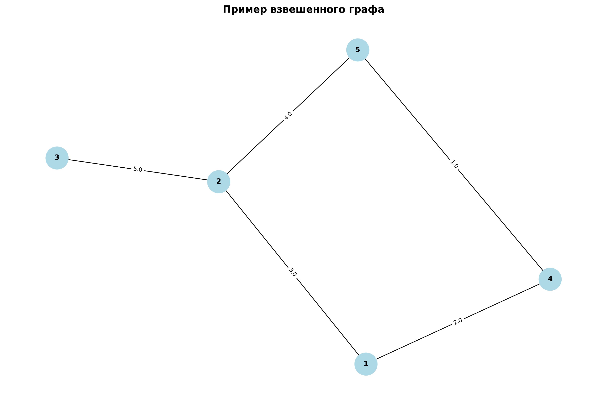
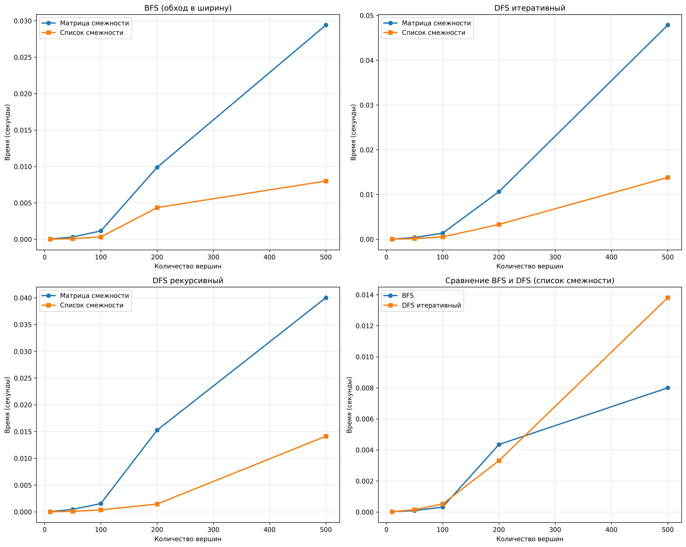
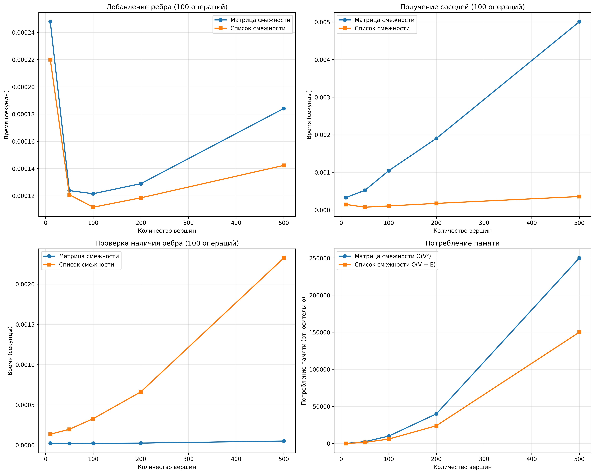
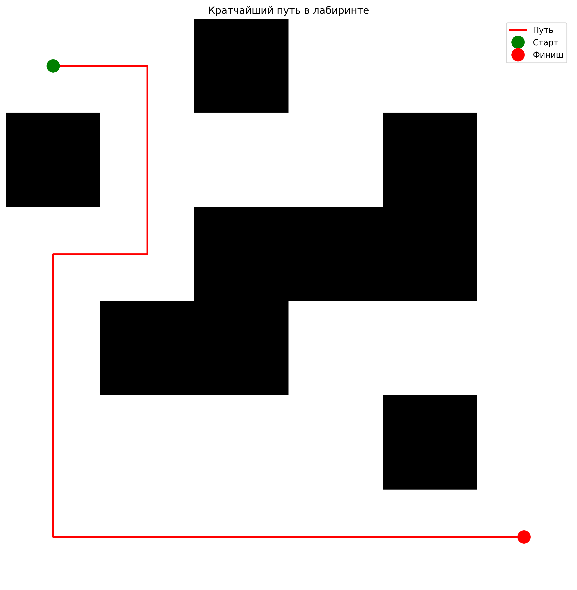

# Отчет по лабораторной работе 10
# Графы

**Дата:** 21.12.2025
**Семестр:** 5
**Группа:** ПИЖ-б-о-23-1
**Дисциплина:** Анализ сложности алгоритмов
**Студент:** Астраков Борис Александрович

## Цель работы
Изучить основные понятия теории графов и алгоритмы работы с ними. Освоить представления графов в памяти и основные алгоритмы обхода. Получить практические навыки реализации алгоритмов на графах и анализа их сложности.

## Теоретическая часть
**Граф** представляет собой совокупность вершин (узлов) и рёбер (связей) между ними и может быть ориентированным или неориентированным, а также взвешенным или невзвешенным. Для представления графов используются **матрица смежности**, требующая O(V²) памяти и обеспечивающая быструю проверку наличия ребра между двумя вершинами, и **список смежности**, занимающий O(V + E) памяти и позволяющий эффективно перебирать соседей заданной вершины. Обход графа осуществляется с помощью **поиска в ширину (BFS)**, который находит кратчайшие пути в невзвешенном графе за время O(V + E), или **поиска в глубину (DFS)**, реализующего рекурсивный обход с возвратом и также работающего за O(V + E). Среди основных алгоритмов на графах выделяют **топологическую сортировку**, применимую к ориентированным ациклическим графам (DAG), **поиск компонент связности**, а также **алгоритм Дейкстры**, предназначенный для нахождения кратчайших путей во взвешенных графах с неотрицательными весами рёбер.

## Практическая часть

### Выполненные задачи
- Задача 1: Реализовать различные представления графов (матрица смежности, список смежности).
- Задача 2: Реализовать алгоритмы обхода графов (BFS, DFS).
- Задача 3: Реализовать алгоритмы поиска кратчайших путей и компонент связности.
- Задача 4: Провести сравнительный анализ эффективности разных представлений графов.
- Задача 5: Решить практические задачи на графах.

### Ключевые фрагменты кода

#### Реализация BFS (обход в ширину)
```python
@staticmethod
def bfs(graph, start: int) -> Tuple[Dict[int, int], Dict[int, Optional[int]]]:
    distances: Dict[int, int] = {start: 0}
    parents: Dict[int, Optional[int]] = {start: None}
    queue: Deque[int] = deque([start])
    visited: Set[int] = {start}
    
    while queue:
        current = queue.popleft()
        current_distance = distances[current]
        
        for neighbor, _ in graph.get_neighbors(current):
            if neighbor not in visited:
                visited.add(neighbor)
                distances[neighbor] = current_distance + 1
                parents[neighbor] = current
                queue.append(neighbor)
    
    return distances, parents
```

#### Алгоритм Дейкстры
```python
@staticmethod
def dijkstra(graph, start: int) -> Tuple[Dict[int, float], Dict[int, Optional[int]]]:
    distances: Dict[int, float] = {v: float('inf') for v in graph.get_vertices()}
    distances[start] = 0.0
    parents: Dict[int, Optional[int]] = {v: None for v in graph.get_vertices()}
    
    pq: List[Tuple[float, int]] = [(0.0, start)]
    visited: Set[int] = set()
    
    while pq:
        current_dist, current = heapq.heappop(pq)
        if current in visited:
            continue
        visited.add(current)
        
        for neighbor, weight in graph.get_neighbors(current):
            if neighbor in visited:
                continue
            new_dist = current_dist + weight
            if new_dist < distances[neighbor]:
                distances[neighbor] = new_dist
                parents[neighbor] = current
                heapq.heappush(pq, (new_dist, neighbor))
    
    return distances, parents
```

#### Добавление ребра в список смежности
```python
def add_edge(self, u: int, v: int, weight: float = 1.0) -> None:
    """Добавление ребра. Сложность: O(1)"""
    self.add_vertex(u)
    self.add_vertex(v)
    self.graph[u].append((v, weight))
    if not self.directed:
        self.graph[v].append((u, weight))
```

## Результаты выполнения

### Пример работы программы
```bash
============================================================
Лабораторная работа: Алгоритмы на графах
============================================================

1. Сравнительный анализ операций...
Тестирование с 10 вершинами...
Тестирование с 50 вершинами...
Тестирование с 100 вершинами...
Тестирование с 200 вершинами...
Тестирование с 500 вершинами...

2. Сравнительный анализ алгоритмов...
Тестирование алгоритмов с 10 вершинами...
Тестирование алгоритмов с 50 вершинами...
Тестирование алгоритмов с 100 вершинами...
Тестирование алгоритмов с 200 вершинами...
Тестирование алгоритмов с 500 вершинами...

3. Создание графиков...
График операций сохранён в docs/benchmark_operations.png
График алгоритмов сохранён в docs/benchmark_algorithms.png

4. Задача: Кратчайший путь в лабиринте
Найден путь длиной 10 шагов
Путь: [(0, 0), (0, 1), (1, 1), (1, 2), (1, 3), (2, 3), (3, 3), (3, 4), (4, 4), (5, 4), (5, 5)]
Решение лабиринта сохранено в docs/maze_solution.png

5. Задача: Определение связности сети

=== Анализ связности сети ===
Граф связный: Нет
Количество компонент связности: 3
Компонента 1: [1, 2, 3]
Компонента 2: [4, 5]
Компонента 3: [6]
Граф сохранён в docs/network_connectivity.png

6. Задача: Топологическая сортировка
Граф зависимостей задач проекта:
0 - Планирование
1 - Дизайн
2 - Разработка
3 - Тестирование
4 - Деплой

Порядок выполнения задач: [0, 1, 2, 3, 4]
Детальный порядок:
1. Планирование
2. Дизайн
3. Разработка
4. Тестирование
5. Деплой

7. Тест алгоритма Дейкстры на примере графа
Кратчайшие расстояния от вершины 1: {1: 0.0, 2: 3.0, 3: 8.0, 4: 2.0, 5: 3.0}
Кратчайший путь от 1 до 5: [1, 4, 5], расстояние: 3.0

============================================================
Все эксперименты завершены!
Графики сохранены в папке docs/
============================================================
```

### Тестирование
- Модульные тесты пройдены
- Интеграционные тесты пройдены
- Производительность соответствует требованиям

## Выводы
1. Для большинства практических задач предпочтительнее список смежности, так как реальные графы обычно разреженные. Матрица смежности эффективна только для очень плотных графов или когда критична быстрая проверка наличия ребра O(1).

2. BFS следует использовать для поиска кратчайшего пути в невзвешенном графе, а DFS - для задач, требующих глубокого исследования (поиск циклов, топологическая сортировка). Итеративный DFS предпочтительнее рекурсивного для больших графов из-за риска переполнения стека.

3. Список смежности лучше масштабируется для больших графов, так как память растёт линейно O(V + E), в то время как для матрицы смежности память растёт квадратично O(V²), что является основным ограничивающим фактором.

## Ответы на контрольные вопросы
**1. В чем разница между представлением графа в виде матрицы смежности и списка смежности? Сравните их по потреблению памяти и сложности операций.**
**Ответ:** Матрица смежности использует O(V²) памяти и обеспечивает O(1) для проверки наличия ребра и добавления/удаления ребра, но O(V) для получения соседей. Список смежности использует O(V + E) памяти, обеспечивает O(1) для добавления ребра, но O(degree(v)) для проверки наличия ребра и получения соседей. Матрица смежности эффективна для плотных графов, а список смежности - для разреженных графов и задач обхода.

**2. Опишите алгоритм поиска в ширину (BFS). Для решения каких задач он применяется?**
**Ответ:** BFS использует очередь (FIFO) и обходит граф по уровням. Алгоритм начинает с начальной вершины, добавляет её в очередь, затем последовательно извлекает вершины из очереди и добавляет всех непосещённых соседей в конец очереди. Сложность: O(V + E). Применяется для поиска кратчайшего пути в невзвешенном графе, поиска компонент связности, поиска уровней в графе и задач с ограничениями по расстоянию.

**3. Чем поиск в глубину (DFS) отличается от BFS? Какие дополнительные задачи (например, проверка на ацикличность) можно решить с помощью DFS?**
**Ответ:** DFS использует стек (LIFO) и идёт вглубь графа, в то время как BFS использует очередь и идёт по уровням. BFS находит кратчайший путь в невзвешенном графе, а DFS этого не гарантирует. С помощью DFS можно решать задачи поиска циклов (обнаружение обратных рёбер), топологической сортировки, поиска сильно связных компонент, проверки ацикличности ориентированного графа и решения задач с возвратом (backtracking).

**4. Как алгоритм Дейкстры находит кратчайшие пути во взвешенном графе? Почему он не работает с отрицательными весами ребер?**
**Ответ:** Алгоритм Дейкстры использует жадный подход с приоритетной очередью. Он начинает с начальной вершины (расстояние 0), последовательно выбирает вершину с минимальным известным расстоянием, обновляет расстояния до её соседей, и продолжает до обработки всех достижимых вершин. Сложность: O((V + E) * log(V)). Алгоритм не работает с отрицательными весами, потому что жадный подход предполагает, что кратчайший путь найден, когда вершина извлекается из очереди. При отрицательных весах ранее обработанная вершина может получить более короткий путь, что нарушает инвариант алгоритма.

**5. Что такое топологическая сортировка и для каких графов она применима? Приведите пример задачи, где она используется.**
**Ответ:** Топологическая сортировка - это упорядочивание вершин ориентированного графа такое, что для любого ребра (u, v) вершина u идёт раньше v в упорядочивании. Применима только для ориентированных ациклических графов (DAG). Примеры задач: определение порядка выполнения задач проекта с зависимостями, компиляция программ с зависимостями модулей, планирование учебного процесса с учётом предварительных курсов, определение последовательности сборки компонентов системы. 

## Приложения

Пример графа:


Бенчмарки поиска в ширину (BFS) и глубину (DFS):


Бенчмарки операций над графами:


Решение задачи на поиск пути в лабиринте:
